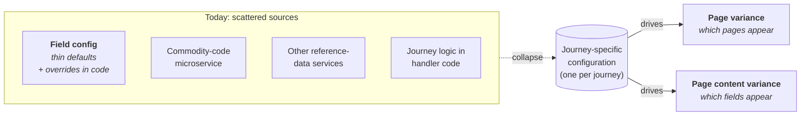
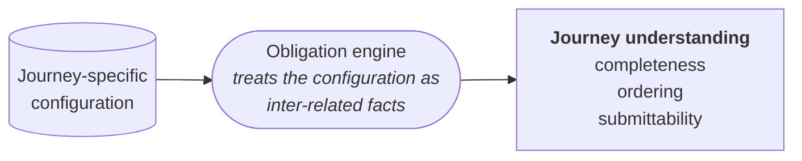
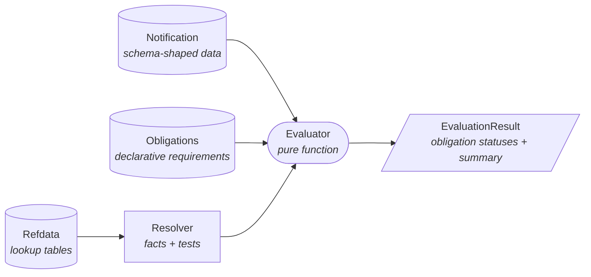
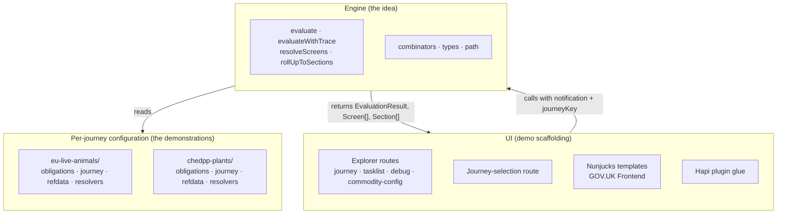

# Journey configuration as a service

A vision for collapsing form configuration, journey logic, and reference data into one shape that can be EXECUTED without having to build the entire journey.

## The vision

Field config was designed for a sound goal: let microservices tailor their own journeys, pages, and page content without bespoke frontends, so that one notification frontend could serve thousands of certificate-type and commodity-code combinations. The design failed and the implementation made it worse - [Appendix A](#appendix-a-why-field-config-is-an-antipattern) catalogues the ten observable problems. The goal itself was right.

The short version of the failure: configs are 97-99% identical across CHED types; 47,491 components embed JavaScript strings as field values; handler code injects override configs the CHED-A configuration knows nothing about; nothing is versioned. Policy complexity that should have been expressed as rules over a small static structure was flattened into thousands of denormalised JSON copies, while the genuinely dynamic parts (overrides, routing, runtime patches) leaked back into code anyway. The system has the costs of both approaches and the integrity guarantees of neither.

This service is an attempt to deliver on the original goal, properly. Three outcomes name what "properly" means:

- **A single source of truth per journey.** Form structure, conditional logic, and reference data live in one place, owned by the team that owns the journey. No overrides hiding in handler code; no separate microservice serving a slice of the form; no implicit conventions documented nowhere.
- **Simple to configure.** Plain JSON for the data, a small resolver file for the logic, a directory per journey. No JavaScript strings embedded as field values, no incompatible structural shapes, no per-config duplication of facts that belong to the journey as a whole.
- **"Complete" is part of the configuration.** Whether a CHED notification (Common Health Entry Document, the IPAFFS notification used to declare regulated imports into Great Britain) is done is not a separate concern computed elsewhere. The same configuration that says what a journey asks for also says what makes the answer enough.

These pair to produce the outcome that matters most: **a whole journey can be seen and tested without being built.** A journey's configuration plus a committed scenario set is enough to walk the journey end-to-end and verify every scenario evaluates to submittable. The UI follows the engine's output; it does not gate verification. New journeys can be reviewed and signed off through configuration and scenarios alone.

## The system in pictures

Four pictures carry the whole design. Everything below this section is elaboration; if you hold these four in mind, no later detail should surprise you.

### Picture 1: the collapse

Today's scattered sources - field-config defaults, the commodity-code microservice, other reference-data services, handler code holding journey logic and ad-hoc overrides - condense into a single shape per journey: a **journey adapter**. The adapter drives the two kinds of variance a journey exhibits.



> **Hold in mind:** one journey, one place to read. Two kinds of question - *which pages?* and *which fields on a page?* - answered from the same configuration.

### Picture 2: the inter-relation

A journey adapter on its own is JSON. The second idea is that this configuration can be **inter-related to understand the journey**: an obligation engine - a pure-function library - treats the adapter's obligations, conditions, and reference data as inter-related facts and turns them into journey understanding.



For a given notification, the engine answers: which obligations are satisfied; which screens are complete, cannot-start-yet, or do not apply; whether the notification is submittable. That output is the only thing a renderer needs.

> **Hold in mind:** the configuration doesn't just render forms - it can be *reasoned over*. The same engine call that gates submission produces the data the task-list view consumes, so drift between what is shown and what is accepted is structurally impossible.

### Picture 3: the evaluation dataflow

How an answer is produced. The notification, the declarative obligations, and the journey's resolver (reading its private reference data) flow into a pure evaluator, which emits a result.



> **Hold in mind:** three inputs, one pure function, one result. No I/O, no framework, no hidden state.

### Picture 4: the three slices

The repository contains three slices. Their sizes are unequal, and that asymmetry is the point: the engine is the idea, the per-journey configuration is the demonstration, the UI is scaffolding to make the output visible.



> **Hold in mind:** the contract between the slices is exactly the engine's input and output - nothing else passes between them. All three run in one process today; the seams are logical, not physical.

## The concepts

The vocabulary, in words. No code yet.

**Journey adapter.** The unit of collapse from Picture 1. A directory per journey declaring what the journey requires, what conditions apply, and what reference data those conditions read. One journey, one place to read.

**Obligation.** A declarative requirement: a statement of what the notification must contain, with a rationale. An obligation asks a **question** of a notification ("is this data present?"). An obligation may carry a **condition** that decides whether the question applies at all.

**Condition, fact, test.** A condition names two things: a *fact* - an extractor that reads a value off the notification - and a *test* - a predicate that decides, from that value and the journey's reference data, whether the condition is active. Both are named by string in the JSON and resolved against the journey's resolver code at evaluation time. The id-string indirection is deliberate: the JSON files stay declarative; behaviour lives in code where it can be tested.

**Refdata.** Journey-private lookup tables. The engine treats refdata opaquely - it passes the data to the resolver functions and does nothing else with it. Two consequences follow: the kernel cannot read refdata (it has no way to know what a journey's table columns mean; only the journey's tests do), and refdata is journey-private (two journeys cannot accidentally couple through shared refdata - cross-journey state is structurally impossible).

**The two kinds of variance.** Both are expressed as obligations with optional conditions:

- **Page variance** - which pages appear in the journey. The CHEDPP GMS-declaration page exists in the configuration but fires only when at least one species on the notification has HMI regulatory authority and GMS marketing standard. The CHED-A CPH-number page exists but fires only for high-risk-EU consignments.
- **Page content variance** - which fields appear on a page that is already present. The animals journey shows "permanent address" only for species stored at a fixed place; plants shows the variety-and-class selection only when both varieties and quality classes are populated.

One configuration; two kinds of question; the same engine call answers both.

**The four statuses.** Every evaluation assigns each obligation one of four statuses:

| Status | Meaning |
| --- | --- |
| `satisfied` | All required data is populated on the notification. |
| `unsatisfied` | Some required data is missing. |
| `deferred` | The obligation is conditional and its fact returned null - the rule doesn't yet know whether the obligation applies. |
| `inactive` | The obligation is conditional and its test decided it does not apply to this notification. |

**Submittability.** A notification is **submittable** when every obligation is either `satisfied` or `inactive`. Unsatisfied and deferred obligations both block submission.

**Screens and sections.** Obligation statuses fold up into UI state. A screen's status follows from the obligations its fields reference; first matching rule wins:

| Predicate over fields' obligation statuses | Screen status |
| --- | --- |
| Any field's obligation is `unsatisfied` | `incomplete` |
| No `unsatisfied`, any is `deferred` | `cannotStartYet` |
| Every referenced obligation is `inactive` | `notApplicable` |
| Otherwise (all `satisfied`, or `satisfied` + `inactive`) | `complete` |

Screens then group into sections: `notApplicable` screens are dropped, a section whose every screen is `notApplicable` is omitted, and section status rolls up by the same first-match discipline. The shape that comes back is what a task-list view renders directly.

A reader who stops here can review a journey design. The rest of the document shows the artefacts.

## The shape of a journey

First contact with the actual files. This section is the structure from Picture 1 made concrete.

A journey adapter is a directory of files. Three are plain JSON data, one is small JavaScript, one assembles them:

| File | Form | Purpose |
| --- | --- | --- |
| `obligations.json` | data | What the notification must contain, conditionally or not |
| `journey.json` | data | The page tree: sections → screens → fields |
| `refdata.json` | data | Journey-private lookup tables |
| `resolvers.js` | code | Functions that read facts off a notification and apply tests against refdata |
| `index.js` | code | Assembles the adapter record |

### The page tree

A journey is structured as a tree:

- A **journey map** is a list of sections.
- A **section** is a list of screens (one task on a task list).
- A **screen** is a list of fields (one form view).
- A **field** may reference an **obligation** by id; that reference is what ties presentation to evaluation.

The page tree carries no logic. Reading `journey.json` tells you what's on which screen and how screens group into sections; nothing about whether anything is satisfied, conditional, or required.

A field in `journey.json` ties a screen position to an obligation:

```json
{
  "id": "origin-section",
  "name": "Origin",
  "screens": [{
    "id": "origin-screen",
    "screenName": "Region of origin",
    "fields": [
      { "fieldName": "originCountry", "fieldType": "text",
        "label": "Country of origin", "obligationRef": "consignment-origin" }
    ]
  }]
}
```

### The obligations

The logic sits in `obligations.json` as declarative requirements - the "declarative requirements" input in Picture 3. An obligation from `eu-live-animals/obligations.json`:

```json
{
  "id": "consignment-origin",
  "name": "Region of origin",
  "rationale": "Origin region drives the regulatory regime.",
  "schemaPaths": ["origin.country", "origin.region"]
}
```

The `schemaPaths` list names the data the obligation requires. If every named path is populated on the notification, the obligation is satisfied; if any is missing, it is not.

A conditional obligation from the same file:

```json
{
  "id": "transit-routing",
  "name": "Transit routing",
  "rationale": "Transit consignments need an onward destination.",
  "schemaPaths": ["destination.exitBIP"],
  "condition": {
    "fact": "purposeGroup",
    "test": "isTransit",
    "description": "Active when the purpose group is a transit purpose."
  }
}
```

The condition names a `fact` and a `test` by string, resolved against `resolvers.js` at evaluation time - the indirection described in the concepts layer.

This is the schema-like view: the journey, its rules, and its presentation are all describable as configuration. Numbers from the two working journeys:

| Journey | Obligations | Sections | Screens |
| --- | --- | --- | --- |
| `eu-live-animals` | 23 | 6 | 15 |
| `chedpp-plants` | 28 | 7 | 16 |

## The mechanics

Full depth: the engine API, a worked evaluation, the resolver code, the refdata shapes, and the slice boundaries spelled out. Keep Picture 3 in mind throughout - everything here is a station on that dataflow.

### The engine API

The engine is five public functions:

| Function | Signature | Returns |
| --- | --- | --- |
| `evaluate` | `(notification, adapter)` | `{ obligations, summary }` |
| `evaluateWithTrace` | `(notification, adapter)` | as above, with per-obligation `trace` |
| `resolveScreens` | `(result, journeyMap)` | `Screen[]` with statuses |
| `rollUpToSections` | `(screens)` | `Section[]` with statuses |
| `combinators` | n/a | `or, and, not, always, never` for composing tests |

### A worked evaluation

A real `EvaluationResult` over a partial notification - the four statuses from the concepts layer, in the wild:

```json
{
  "obligations": [
    { "id": "notification-type",    "status": "satisfied",   "missingPaths": [] },
    { "id": "consignment-origin",   "status": "unsatisfied", "missingPaths": ["origin.region"] },
    { "id": "transit-routing",      "status": "inactive",
      "reason": "purposeGroup \"For Import\" is not a transit purpose" },
    { "id": "animal-identification","status": "deferred",
      "reason": "commodity not yet provided" },
    { "id": "legal-declaration",    "status": "unsatisfied", "missingPaths": [] }
  ],
  "summary": {
    "satisfied": 1, "unsatisfied": 2, "deferred": 1, "inactive": 1,
    "total": 5, "submittable": false
  }
}
```

Status detail beyond the concepts layer: `deferred` means the condition's fact returned null; `inactive` means the condition's test returned `{ active: false }`. The same result, folded over the journey map by `resolveScreens`, becomes a flat list of screens with derived statuses (the first-match rules in the concepts layer), and `rollUpToSections` produces the render-ready section list.

### Resolvers: how rules are written

The resolver is where an author writes both halves of an obligation's question. Two function records sit on every resolver:

- **`facts`**: extractors over the notification. A fact is `(notification) → value`. Returning `null` defers the obligation (the engine reads a null fact as "not yet decidable").
- **`tests`**: predicates over a fact value and the journey's refdata. A test is `(factValue, refdata) → { active, reason }`. The `active` boolean drives the obligation's activation; the `reason` string surfaces in the trace.

Example from `chedpp-plants/resolvers.js` (simplified):

```javascript
export const resolvers = {
  facts: {
    speciesForCommodity: (notification) =>
      notification?.commodities?.[0]?.species ?? null
  },
  tests: {
    requiresGmsDeclaration: (species, refdata) => {
      const row = refdata.species[`${species.code}|${species.eppoCode}`]
      const active = row?.regulatory_authority === 'HMI'
                  && row?.marketing_standard === 'GMS'
      return { active, reason: active
        ? 'species is HMI with GMS marketing standard'
        : 'species does not meet HMI + GMS criteria' }
    }
  },
  submissionDatePath: 'submittedAt'
}
```

The obligation references those two by string: `condition.fact = "speciesForCommodity"`, `condition.test = "requiresGmsDeclaration"`. The engine looks both up at evaluation time.

**Combinators** compose tests into new tests. They are higher-order functions that take `ConditionTest` values and return a `ConditionTest`:

```javascript
// In a resolver: compose two tests with a universal combinator
tests.requiresOnwardRouting = or(tests.isTransit, tests.isTranshipment)
```

The engine treats the result as an ordinary test. Five universal combinators ship with the kernel:

| Combinator | Semantics |
| --- | --- |
| `or(...tests)` | Short-circuits on the first active test |
| `and(...tests)` | Short-circuits on the first inactive test |
| `not(test)` | Negates the active boolean; wraps the reason |
| `always(reason)` | Always active |
| `never(reason)` | Always inactive |

A helper that reads refdata shape (for example a `refdataFlag(flagName, on, off)` helper that knows the routing-table layout in animals) is journey-private by definition: it presupposes a refdata shape so it cannot be universal. A test that composes purely through universal combinators stays kernel-portable.

### Refdata: collapsed into small JSON files

The principles (kernel-opaque, journey-private) are in the concepts layer; here are the actual shapes. The kernel has no way to know what `refdata.species[code|eppo].regulatory_authority` means; only the journey's tests do.

**`eu-live-animals/refdata.json`** uses a routing table keyed by `${commodity.id}|${species.name}` with a fallback to `${commodity.id}|` for species that aren't enumerated. Each entry holds the routing flags (`cph_number`, `permanent_address`, `transporter_address`) that drive conditional obligations.

**`chedpp-plants/refdata.json`** uses a two-map shape:

```json
{
  "commodities": {
    "0808108090": {
      "group": "Fruit and nuts",
      "requires_test_and_trial": false,
      "requires_finished_or_propagated": false,
      "propagation": null,
      "classes": ["Extra Class", "Class I", "Class II"]
    }
  },
  "species": {
    "0808108090|MABSD": {
      "regulatory_authority": "JOINT",
      "marketing_standard": "SMS",
      "validity_period": "7",
      "varieties": ["Braeburn", "Bramley", "Cox's Orange Pippin"]
    }
  }
}
```

`commodities` holds 521 entries; `species` holds 5,321. Production data behind these maps spans roughly 486,000 (commodity, species) pairs in the upstream commodity-code microservice; the file ships only the 5,321 pairs that carry marketing-standards variance. The 480,505 PHSI-only pairs (Plant Health and Seeds Inspectorate, the default authority) are represented by absence: a commodity with no species entries is read as PHSI-only.

The full data model, the recovery of the normal form from the upstream tables, the production distribution, and the GMS-declaration predicate are documented in `src/server/journeys/chedpp-plants/research.md`.

### The three slices, precisely

Picture 4, with its boundaries spelled out.

The **engine** lives in `src/server/engine/`. It is the substantive contribution: a small library of pure functions with no framework imports. Five public functions plus a handful of combinators. This is the idea.

The **per-journey configuration** lives in `src/server/journeys/`. It is the demonstration that the idea works. Two journeys (`eu-live-animals` and `chedpp-plants`) ship as JSON data files and a small resolver file each. Either one can be replaced or extended without touching the engine; adding a third requires no engine changes.

The **UI** lives in `src/server/routes/`, `src/server/common/templates/`, and `src/server/plugins/`. It is demo scaffolding. The four explorer views, the journey-selection page, the Nunjucks templates, and the Hapi plugin glue exist to make the engine's output visible end-to-end and to prove the idea works against real journeys. They are not the idea. A different consumer of this service could ship a completely different UI; the engine and the per-journey configuration would not change. The UI never inspects the journey map directly; the engine resolves the map into a flat render-ready model and hands the UI the result.

The contract between the slices is exactly the engine's input and output: the UI calls `evaluate`, `resolveScreens`, or `rollUpToSections` with a notification and a journey key; the engine reads the journey's configuration; the engine returns `EvaluationResult`, `Screen[]`, or `Section[]` (with an optional `trace` field for diagnostics). Nothing else passes between them.

All three slices run in the same process today. The seams are logical, not physical. The framework-isolation property (zero `@hapi/*` imports under `engine/`) keeps the engine library-shaped, so the UI/engine seam could become an HTTP boundary later without restructuring the engine.

## How the demo runs over HTTP

The `features/http-api/` work surfaces the engine and configuration as **two HTTP API namespaces**, lets the UI consume them over loopback, and documents the lot in a single Swagger page. The architecture is now legible from outside the process — `curl`, Postman, and DevTools see what the audience needs to see.

**Two namespaces, one Swagger UI at `/documentation`:**

| Namespace | Question it answers | Example |
|---|---|---|
| `/api/config/*` | *What is the journey?* | `GET /api/config/journeys`, `GET /api/config/journeys/{key}/commodities/{code}/species/{species}` |
| `/api/engine/*` | *How does this notification evaluate against the journey?* | `POST /api/engine/journeys/{key}/evaluate?withTrace=true`, `.../sections` |

A third, smaller surface `PUT /ui/session/notification` is the UI's "in-memory database" — explicit session persistence that lets the debug page's edits propagate to the task-list view. The browser fires it sequentially before each evaluate so the cross-page bridge is honest, not a side effect.

**Three Postman recipes** that exercise the architecture end-to-end:

```bash
# 1. List registered journeys (the config side).
curl http://localhost:3000/api/config/journeys

# 2. Drill into one commodity's driver (Plants apples, MABSD species).
curl http://localhost:3000/api/config/journeys/chedpp-plants/commodities/0808108090/species/MABSD

# 3. Evaluate a notification (paste the JSON from /explorer/debug's
#    editor as the request body; ?withTrace=true returns per-obligation
#    diagnostic trace steps).
curl -X POST \
  http://localhost:3000/api/engine/journeys/eu-live-animals/evaluate?withTrace=true \
  -H 'content-type: application/json' \
  -d '{"origin":{"country":"NL"},"commodities":[{"id":"21044150"}]}'
```

**Demo framing — not a microservice split.** Two namespaces, one Hapi process, one shared evaluation-engine facade. The engine needs the resolvers (per-journey JavaScript), and resolvers presuppose refdata shape, so config and engine ship together. What we gained by extracting the boundary is *visibility*: the audience can hit the same endpoints the UI hits, see the JSON the engine returns, and read the contract on Swagger UI in the browser. The `/commodities/{code}` endpoint is the FE's SDUI narrative primitive — *"origin → commodity → which downstream pages now apply"*.

**Pointers:**
- Full design rationale: `features/http-api/design.md`.
- Manual smoke checklist (12 steps, ~5 min): `features/http-api/design.md` § "Smoke checklist".
- Drift canary: `src/server/plugins/http-api/parity.test.js` — facade vs HTTP for every scenario × journey × `withTrace` mode.

## Today's spike, tomorrow's service

What the spike proves:

- **One engine, two journeys.** No journey-specific code lives in `engine/`. Adding a third adapter requires zero engine changes.
- **Drift is structurally impossible.** The same engine call that drives `/explorer/tasklist` is what gates submission. Two paths, one truth.
- **The kernel-adapter boundary is machine-enforced.** A test statically imports every file under `engine/` and asserts the module graph contains no `@hapi/*` dependency.
- **Refdata fits in small JSON files.** Animals refdata is a few hundred routing entries; plants refdata is ~6,000 entries derived from a 486K-pair production source by recognising that 98.9% of the source carried no journey variance.
- **Runtime journey switching works.** The picker at `/journey-selection` switches the active journey at request time; the engine resolves the new adapter and reuses the same evaluation surface.

What a future *journey configuration service* would add on top:

- **An HTTP boundary** over the engine. The engine functions become a service API. No change to engine internals - the framework-isolation discipline already keeps the engine shaped as a library.
- **A registry** that loads journey adapters at deploy or runtime, rather than the hardcoded list this spike ships.
- **Versioning** for the JSON artefacts (`obligations.json`, `journey.json`, `refdata.json`) so consumers can pin to a known schema and migrations stay explicit.
- **A comprehensive validator** that emits structured `Issue` reports for the coherence rules an adapter must satisfy (every `obligationRef` resolves; every condition `fact` and `test` exists; every `schemaPath` is a dot-notation string; etc.). Today the engine fails fast on the first violation it encounters; a richer validator would surface all issues in one pass.

The replacement story for field config:

- **Today.** Field config holds form structure in one service; refdata in another; journey rules in handler code inside the IPAFFS notification frontend. A change that crosses two of those concerns crosses two systems.
- **With this service.** Form structure (`journey.json`), rules (`obligations.json` + `resolvers.js`), and refdata (`refdata.json`) are co-located per journey behind one evaluation surface. A consumer asking "what should this user see next, and what's required for submission?" calls one service, not three.

## Where to read deeper

- `src/server/journeys/chedpp-plants/research.md` for the plants data model, the production distribution behind the refdata file, and the GMS-declaration predicate cited to its source in IPAFFS.
- `src/server/engine/` for the engine source. Five files plus `types.js`; under 600 lines of code.
- `src/server/journeys/eu-live-animals/` and `src/server/journeys/chedpp-plants/` for the two working adapters.
- `src/server/routes/explorer/` for the four views that exercise the engine end-to-end against either journey: the journey config view, the task list, the evaluation debugger, and the commodity config inspector.

## Appendix A: why field config is an antipattern

Field config is the JSON-based system that drives the IPAFFS UI today. Ten observable problems:

- **Concerns conflated.** Presentation, validation, and journey logic share one blob; a "validation" change can re-route screens.
- **Vast duplication.** Configs are 97-99% identical across CHED types; the variation is storage artefact, not business requirement.
- **Overrides leak into code.** Handler code injects separate `IMP` configs into the CHED-A journey via three ad-hoc patterns; a CHED-A journey cannot be determined from CHED-A config alone.
- **Two incompatible shapes.** `IMP` is an object keyed by page; `CHED` is an array of pages; `sections[i]` is sometimes an object, sometimes a variant array. Every consumer writes dual-path parsing.
- **Presence/visibility conflated.** Optionality is encoded by component absence rather than an explicit `visible: false`.
- **Code in data.** 47,491 components (16.6%) embed JavaScript strings as field values; no schema catches a rename.
- **Variant-array redundancy.** Every plants config ships ~85 internal-market variants although one applies per notification.
- **Lost trust.** Identifier display moved off onto notification data after sync failures; Part 2 inspector decisions use a separate hardcoded driver; Part 3 does not use field config at all; consumers patch configs at runtime.
- **No versioning.** The `/v2/` endpoint has no compatibility process; no record exists of which config version processed a notification.
- **Staleness.** Reference data unrefreshed since the 2018 scrape from TRACES (the EU Trade Control and Expert System that preceded IPAFFS), despite post-Brexit divergence.

The through-line: policy complexity that should have been expressed as rules over a small static structure was flattened into thousands of denormalised JSON copies, while the genuinely dynamic parts (overrides, routing, runtime patches) leaked back into code anyway. The system has the costs of both approaches and the integrity guarantees of neither.
