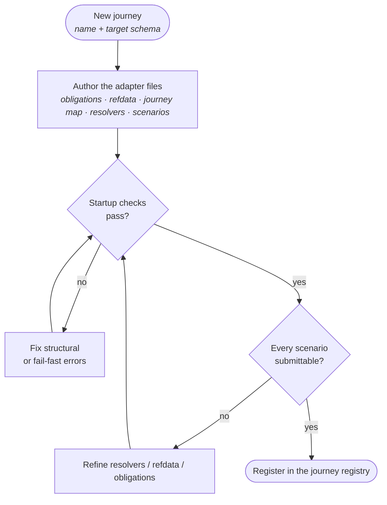
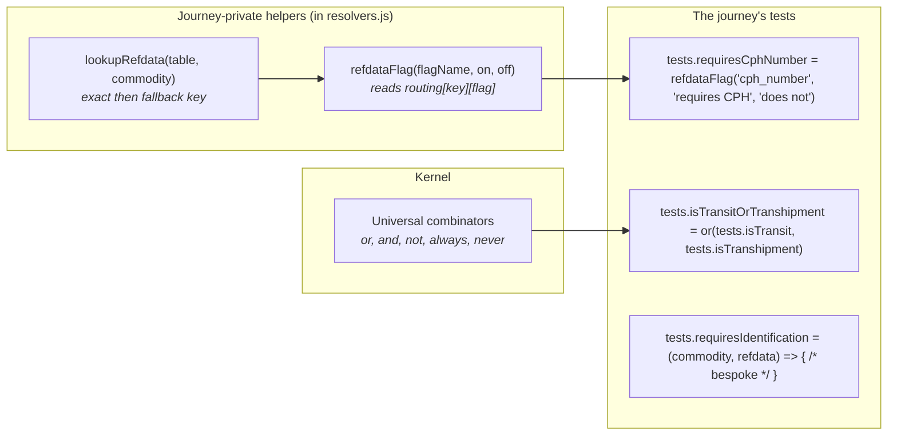
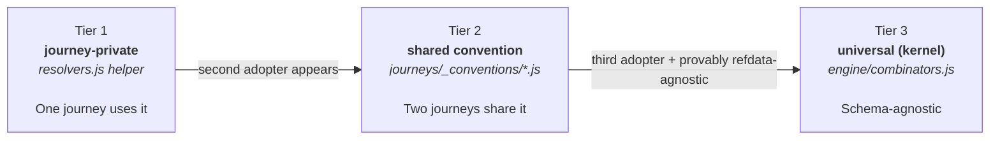

# Authoring Journeys

> Phase 4 of the design conversation. Looks at the system from the
> *author's* point of view: what they write, in what order, and what
> the kernel does for them. Takes the protocol (`protocol.md`) and the
> engine internals (`engine-design.md`) as given.
>
> **This describes the target state — the authoring experience *after*
> the refactor stages in `engine-design.md` land.** Today's experience
> is a subset: the universal combinators `or`/`and`/`not`/`always`/
> `never` are not yet kernel-exported (chedpp-plants has a local `or`),
> and per-journey `*.contract.test.js` files are not yet built. The
> shape of the authoring experience above is what these stages produce.
>
> **Validation is parked.** Coherence checks beyond the existing
> structural startup throw (`validateJourney` in the plugin) are
> deliberately out of scope. The coherence rules in `protocol.md` §4
> describe the design *intent*; the tooling that would enforce all of
> them is a separate piece of design work whose requirements aren't
> yet settled.

## 1. The authoring lifecycle



One mechanical gate today: **the scenarios** — every fixture must
evaluate to `submittable: true`. Structural problems surface either at
plugin startup (the `validateJourney` throw) or fail-fast at the use
site (e.g. `resolveScreens` throws on dangling `obligationRef`). A
designed graph validator that reports all coherence issues at once is
parked work.

## 2. What a journey author writes

One adapter is one directory with six files:

| File | Authored as | What it is |
|---|---|---|
| `obligations.json` | data | The regulatory requirements: id, name, rationale, schemaPaths, optional condition |
| `refdata.json` | data | Journey-private lookup tables. Shape is the journey's own choice — opaque to the kernel |
| `journey.json` | data | The page structure: sections → screens → fields with `obligationRef` and `visibility.dependsOn` |
| `resolvers.js` | code | Facts (`(notification) → value`), tests (`(value, refdata) → {active, reason}`), and `submissionDatePath` |
| `scenarios.js` | code | Demo fixtures: each is a complete notification that should evaluate `submittable: true` |
| `index.js` | code | Assembles the `JourneyAdapter` record: `{ key, obligations, refdata, journeyMap, journeyResolver, scenarios }` |

The split between data and code is deliberate: the kernel sees data
through its protocol, and code where the protocol explicitly requires
behaviour (resolvers).

## 3. Resolver authoring

The journey resolver is where schema knowledge lives. Two layers compose
the tests an author actually writes.



Three styles of authoring, in increasing order of effort:

1. **Compose with a journey-private helper** (T1 above) — the highest-
   leverage style. Four eu-live-animals tests collapse to one-line
   declarations through `refdataFlag`. The helper knows the refdata
   shape; the test declares intent.
2. **Compose with a universal combinator** (T2 above) — when the
   composition is purely logical (OR/AND/NOT) over existing tests.
   No new schema knowledge needed.
3. **Write a bespoke test** (T3 above) — when neither composition nor
   a helper fits, write the function directly. The contract is small:
   `(factValue, refdata) → {active, reason}`.

## 4. The combinator promotion path

A helper or combinator earns its keep by reuse, not by aesthetics.
Authors should default to the lowest tier and only promote when reality
forces them up.



A few rules of thumb:

- A helper that touches `refdata.routing[key][flag]` is **never** tier 3
  — it presupposes a refdata shape, so it cannot be universal.
- The shared-convention tier (tier 2) exists but is unbuilt today.
  We'll create it when the first cross-journey duplication appears,
  not before.
- Universal combinators (tier 3) operate purely on `ConditionTest`
  values. They compose schema knowledge they do not themselves possess.

## 5. Authoring safety today

Coherence rules (per `protocol.md` §4) describe what makes an adapter
valid. Enforcement is currently partial, in two layers:

- **Plugin startup checks** (`validateJourney` in
  `src/server/plugins/evaluation-engine/index.js`) throw on missing or
  malformed top-level fields. Fail-fast at boot; the journey can't be
  registered if these fail.
- **Use-site fail-fast.** The engine throws on referential problems
  *when it encounters them* — e.g. `resolveScreens` throws on a
  dangling `obligationRef`; `evaluate` throws on an unknown fact or
  test name. The error surfaces when the journey is exercised.

A comprehensive validator that produces structured `Issue` reports for
the full coherence rules at once is **parked design work** — see the
note at the top of this doc and `engine-design.md`. Until that work is
designed and scoped, authors rely on the two-layer fail-fast above plus
the per-journey contract test (§6).

## 6. Per-journey contract test

Every adapter ships with a `journey.contract.test.js` file. One
assertion proves fitness for the engine — every scenario evaluates
submittable:

```javascript
// journeys/<key>/<key>.contract.test.js  (sketch)
import { evaluate } from '#server/engine'
import adapter from './index.js'

test.each(Object.entries(adapter.scenarios))(
  'scenario "%s" evaluates submittable',
  (_name, scenario) => {
    const { summary } = evaluate(scenario.notification, adapter)
    expect(summary.submittable).toBe(true)
  }
)
```

This is the test that gives a reviewer confidence the journey isn't
broken — no need to read the full journey to evaluate it. It exercises
the full engine path against the journey's own scenarios; structural
problems surface as throws, semantic problems as `submittable: false`.

## 7. Open questions for Phase 4 sign-off

1. **Convention library location.** When the second journey adopts the
   same refdata-flag pattern, the shared file should land somewhere.
   Proposed: `src/server/journeys/_conventions/`. Honest, but unbuilt;
   any preferences for naming?
2. **Scenario authoring discipline.** Today scenarios are hand-written
   notifications. Should we require each scenario to declare *what it
   covers* (a comment? a manifest entry?), so the scenario set is a
   purposeful regression suite rather than an accidental one?
