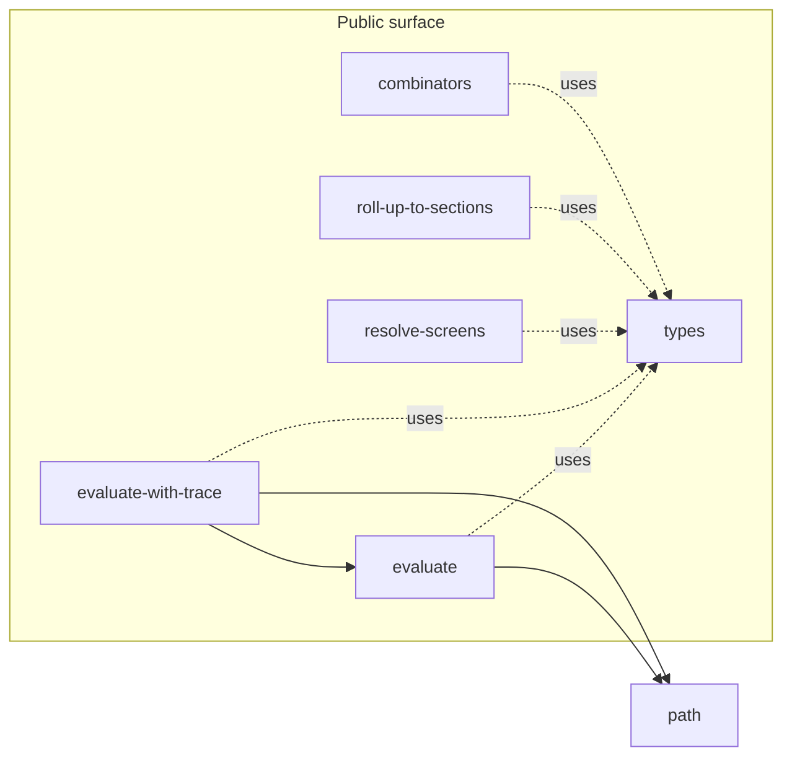

# Engine Design — Internals of the Engine Library

> Phase 3 of the design conversation. Defines how the engine is
> internally structured to deliver the protocol from `protocol.md`. This
> doc takes the contract as given; the only freedom here is how to
> compose pure functions to implement it.

Four constraints govern every decision below:

- **Engine is framework-agnostic.** Conceptually a standalone library
  we happen to use inside this project. Zero Hapi imports, zero
  Node-specific I/O. Hosts pass values in, get values back. The Hapi
  binding is a separate file at the framework layer.
- **Fewer files is better.** Extract only when there's true cross-module
  reuse. Otherwise keep helpers private to the module that uses them.
- **Test-first.** Every stage starts by writing or extending tests
  against the behaviour being preserved or added; run red, then make
  green. The `.claude/skills/valuable-unit-tests.md` skill governs test
  selection (state behaviour + risks, pick 2–5 high-value cases, reject
  low-value cases explicitly). Mocking is a smell — if a pure-logic
  function needs more than one or two mocks, the module shape is wrong.
- **Every PR ships green and functional.** All tests pass; every UI
  view (the explorer's journey view, debug view, task list, and
  commodity-config viewer) renders correctly against every registered
  adapter. No stage ships with regressed tests or regressed UI. Branch-
  by-abstraction is the technique that keeps this true across multi-step
  refactors: introduce the new path beside the old, switch consumers
  one at a time, remove the old once nothing uses it.

## 1. Module inventory

| Module | Public? | Implements |
|---|---|---|
| `types.js` | Yes (constants + typedefs) | `OBLIGATION_STATUS`, `SCREEN_STATUS`, JSDoc typedefs |
| `evaluate.js` | Yes (function) | `evaluate(notification, adapter)` |
| `evaluate-with-trace.js` | Yes (function) | `evaluateWithTrace(notification, adapter)` |
| `resolve-screens.js` | Yes (function) | `resolveScreens(result, journeyMap)` |
| `roll-up-to-sections.js` | Yes (function) | `rollUpToSections(screens)` |
| `combinators.js` | Yes (5 functions) | `or`, `and`, `not`, `always`, `never` |
| `path.js` | No (shared) | `resolvePath`, `isEmpty` — used by `evaluate.js` and `evaluate-with-trace.js` |
| `index.js` | Yes (re-exports) | The engine's public surface |

`path.js` is the only non-public file. Everything else is either part of
the public surface or a private helper *inside* a public module. Private
helpers are tested through their owning public function's contract tests;
they are implementation details, not extracted surface.

## 2. Directory layout (post-refactor)

```
src/server/
├── engine/                       # the framework-agnostic library
│   ├── index.js                  # re-exports the public surface
│   ├── types.js
│   ├── evaluate.js
│   ├── evaluate-with-trace.js
│   ├── resolve-screens.js
│   ├── roll-up-to-sections.js
│   ├── combinators.js
│   └── path.js                   # internal-shared utilities
├── journeys/                     # each journey adapter, already in shape
│   ├── eu-live-animals/
│   └── chedpp-plants/
└── plugins/
    └── evaluation-engine/
        └── plugin.js             # the Hapi binding; ONLY framework glue
```

Reading the tree top-to-bottom: `engine/` and `journeys/` are the
*conceptual libraries*. `plugins/evaluation-engine/plugin.js` is the
only file that knows about Hapi. If you grep for `@hapi` inside
`engine/` or `journeys/`, you get zero hits — by design and by test.

`plugin.js` composes the engine's pure functions with the journey
registry, runs the existing structural startup checks
(`validateJourney`-equivalent), and binds `server.app.evaluationEngine`.
Hosts that need direct access (unit tests, future consumers, scripts)
import from `engine/` directly and bypass the plugin.

> **Validation is parked.** A comprehensive validator that produces
> structured `Issue` reports for the full coherence rules in
> `protocol.md` §4 is *not* in scope. Today's structural startup check
> moves to `plugin.js` as-is; broader validation will be designed
> separately when its requirements are clearer.

## 3. Module composition



Notable composition properties:

- **`evaluate-with-trace` composes `evaluate`** for canonical equivalence
  assertion, then re-runs with step capture. Today's pattern; preserved.
- **`combinators` has zero internal-helper dependencies.** It operates
  purely on `ConditionTest` values — the most decoupled module.
- **`types.js` has zero imports.** Everything else may import from it.
- **`resolve-screens` and `roll-up-to-sections` have no internal-helper
  dependencies.** Each keeps its private functions inside the module
  that uses them.

## 4. Where today's code lands

| Current location | Symbol | Lands at |
|---|---|---|
| `evaluate-obligations.js` | `evaluateObligations` | `engine/evaluate.js` as `evaluate` (returns summary; see Stage 0) |
| `evaluate-obligations.js` | `evaluateSatisfaction` | stays inside `engine/evaluate.js` (private) |
| `evaluate-obligations.js` | `resolvePath` | `engine/path.js` |
| `evaluate-obligations.js` | `isEmpty` | `engine/path.js` |
| `trace-evaluate-obligations.js` | `traceEvaluateObligations` | `engine/evaluate-with-trace.js` as `evaluateWithTrace` |
| `trace-evaluate-obligations.js` | step builders | stay inside `engine/evaluate-with-trace.js` (private) |
| `trace-evaluate-obligations.js` | `calculateSummary` | stays inside `engine/evaluate.js` (private; called from both evaluate paths) |
| `trace-evaluate-obligations.js` | `assertEquivalence` | stays inside `engine/evaluate-with-trace.js` (private) |
| `routes/explorer/map-to-screens.js` | `mapToScreens` | `engine/resolve-screens.js` as `resolveScreens` |
| `routes/explorer/map-to-screens.js` | `rollUpToSections` | `engine/roll-up-to-sections.js` |
| `routes/explorer/map-to-screens.js` | `deriveScreenStatus` | stays inside `engine/resolve-screens.js` (private) |
| `routes/explorer/map-to-screens.js` | `deriveSectionStatus` | stays inside `engine/roll-up-to-sections.js` (private) |
| `evaluation-engine/index.js` | Hapi plugin + journey registry | `plugins/evaluation-engine/plugin.js` |
| `evaluation-engine/index.js` | `validateJourney` (inline) | stays inline in `plugins/evaluation-engine/plugin.js` (unchanged) |
| *(new)* | `or`, `and`, `not`, `always`, `never` | `engine/combinators.js` |
| *(new)* | `OBLIGATION_STATUS`, `SCREEN_STATUS`, typedefs | `engine/types.js` |

## 5. Refactor sequence

### Stage 0 — Preflight: `evaluate` returns summary

Today's `evaluateObligations` returns `{obligations}` only; summary is
computed only in the trace path. Per `protocol.md` §5.1 the contract is
`{obligations, summary}`. Treat this as an oversight fix, not part of
the structural refactor: a small commit that adds the summary
calculation to `evaluateObligations` and extends its existing test to
assert the new shape. Done before Stage 1.

After preflight, the remaining work is three stages. Stage 2 is split
into six sub-PRs to satisfy the branch-by-abstraction constraint; every
other stage is one PR.

### Stage 1 — Declare protocol types

New `engine/types.js` containing the typedefs and frozen status
constants from `protocol.md` §2. Existing modules import the constants
in place of their string literals. No behaviour change. Tests assert
the constants resolve to the literal values they replace.

### Stage 2 — Engine boundary (branch-by-abstraction)

Six sub-PRs, each independently green. Old import paths keep working
via re-export shims until 2e removes them.

- **2a — `engine/path.js`.** Extract `resolvePath` + `isEmpty` into the
  new file. Update `evaluate-obligations.js` and
  `trace-evaluate-obligations.js` to import from there. Add path
  contract tests (table-driven over dot-notation paths and emptiness
  rules).
- **2b — `engine/evaluate.js`.** Create the new module. Old
  `evaluate-obligations.js` becomes a thin re-export shim
  (`export { evaluate as evaluateObligations } from './engine/evaluate.js'`).
  Add `evaluate` contract tests against `protocol.md` §5.1.
- **2c — `engine/evaluate-with-trace.js`.** Same pattern.
  `trace-evaluate-obligations.js` becomes a re-export shim. Add
  contract tests against `protocol.md` §5.2.
- **2d — `engine/resolve-screens.js` + `engine/roll-up-to-sections.js`.**
  Same pattern. `routes/explorer/map-to-screens.js` becomes a re-export
  shim. Add contract tests against `protocol.md` §5.3 and §5.4.
- **2e — Switch callers, delete shims, add isolation test.** Every
  route handler / consumer imports from `engine/*` directly. Re-export
  shim files are deleted. Add the framework-isolation test: import
  every file under `engine/` and assert the resulting module graph
  contains no `@hapi/*` package.
- **2f — Extract `plugins/evaluation-engine/plugin.js`.** The plugin
  shrinks to the Hapi binding: registry + startup validation + binding
  `server.app.evaluationEngine`. Engine functions are imported from
  `engine/*`.

### Stage 3 — Universal combinators

New `engine/combinators.js` exporting `or`, `and`, `not`, `always`,
`never`. Replace chedpp-plants' local `or` with the engine-exported one.
Combinator contract tests against `protocol.md` §5.5.

### Parked: comprehensive validator

A pure-function validator that emits structured `Issue` reports for the
full coherence rules in `protocol.md` §4 is **out of scope**. Today's
structural startup check stays inline in the Hapi plugin (Stage 2f).
Designing a richer validator is its own piece of work; it should not be
folded into refactor stories.

## 6. Test strategy

Test-first per the project's `.claude/skills/valuable-unit-tests.md`:
state behaviour and risks in ≤5 lines, pick 2–5 high-value cases, reject
low-value cases explicitly, then write. Prefer table-driven tests for
input/output rules. Don't test implementation details; don't snapshot
when a focused assertion would do.

### Contract tests — the floor

Every public engine function has a test file that owns the corresponding
`protocol.md` §5 section as its contract. These are non-negotiable;
they exercise every shape, every invariant, every throw condition the
protocol declares.

| Test file | Owns |
|---|---|
| `engine/evaluate.test.js` | §5.1 — every obligation shape variant, summary invariants, throws |
| `engine/evaluate-with-trace.test.js` | §5.2 — status equivalence with `evaluate`, trace shape per terminal step |
| `engine/resolve-screens.test.js` | §5.3 — screen shape, the status-derivation table, throws |
| `engine/roll-up-to-sections.test.js` | §5.4 — section shape, filtering rules, throws |
| `engine/combinators.test.js` | §5.5 — semantics for each combinator (including short-circuit + reason composition), throws |
| `journeys/<key>/<key>.contract.test.js` | Per-adapter: every scenario evaluates to `submittable: true` |

### Inner-helper tests — only where they earn their keep

Private helpers (e.g. `evaluateSatisfaction` inside `evaluate.js`, the
step builders inside `evaluate-with-trace.js`, the status deriver inside
`resolve-screens.js`) get dedicated tests only when:

- The helper has branching or boundary behaviour that's costly to reach
  via the public surface, or
- The helper is the highest-value place to catch a class of regression
  (per the selection rules in `valuable-unit-tests.md`).

Helpers do not get tests because they exist. Coverage isn't the goal;
risk is. The valuable-unit-tests skill is the decision tool.

### Cross-cutting tests

- **Status equivalence:** `evaluate` and `evaluateWithTrace` produce
  identical `obligations[i].status` for the same inputs. (Same check
  `assertEquivalence` makes inline today, lifted to a test.)
- **Framework isolation:** import every file under `engine/` and assert
  the module graph contains no `@hapi/*` package. The library boundary
  becomes machine-enforced. Added in stage 2e.
- **Real-data integration:** load each registered adapter's
  obligations / refdata / journey map / scenarios; run scenarios end-to-end
  through `evaluate → resolveScreens → rollUpToSections`. No mocks.
  This is what proves the UI invariant holds — it's the same code path
  the explorer's views run.

## 7. Open questions for Phase 3 sign-off

1. **Engine directory location.** `src/server/engine/` makes the
   framework-agnostic boundary visible. Acceptable, or do you want it
   somewhere else (e.g. `src/engine/`, `lib/engine/`)?
2. **`path.js` naming.** It's the only non-public file. `path.js` is
   honest about content; `_path.js` would signal "internal". Either
   works; preference?
