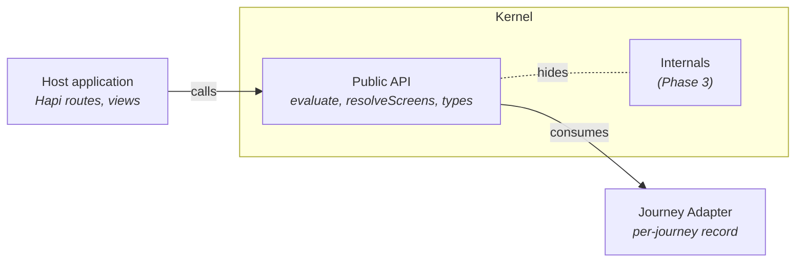

# Protocol — Interfaces between Kernel, Adapter and Host

> Phase 2 of the design conversation. Defines the seams that the kernel,
> adapter and host application agree on. Phase 3 (engine internals) and
> Phase 4 (authoring affordances) both depend on this contract.

## 1. Where the seams are

Two surfaces. The kernel's *public API* is what host code calls. The
*adapter contract* is what the kernel demands of every journey adapter.



Two seams:

- **A (host ↔ kernel public API):** the kernel exports a small set of
  pure functions plus protocol types. Hosts depend on this only.
- **B (kernel ↔ adapter):** the kernel requires every journey to expose
  an adapter record matching a fixed shape. Hosts compose adapters and
  hand them to the kernel.

## 2. Contract inventory

The interfaces to declare, grouped by which seam they cross.

| # | Interface | Seam | Purpose |
|---|---|---|---|
| 1 | `ObligationStatus` (enum) | A + B | The 4-value protocol vocabulary (`satisfied`, `unsatisfied`, `deferred`, `inactive`). |
| 2 | `ScreenStatus` (enum) | A | The 4-value screen vocabulary (`complete`, `incomplete`, `cannotStartYet`, `notApplicable`). |
| 3 | `JourneyAdapter` (record) | B | The whole journey contribution: data + journey resolver. |
| 4 | `Obligation` (record) | B | A declarative requirement; optionally conditional. |
| 5 | `Condition` (record) | B | An obligation's activation predicate, by reference. |
| 6 | `JourneyMap` / `Section` / `ScreenDef` / `Field` / `Visibility` | B | The page structure. |
| 7 | `JourneyResolver` (record) | B | `facts` + `tests` + `submissionDatePath`. |
| 8 | `FactExtractor` (function) | B | `(notification) → any \| null`. |
| 9 | `ConditionTest` (function) | B | `(factValue, refdata) → TestResult`. |
| 10 | `TestResult` (record) | B | `{ active, reason }`. |
| 11 | `EvaluationResult` (record) | A | Engine output: `{ obligations[], summary }`. |
| 12 | `EvaluatedObligation` (record) | A | Per-obligation result: `{ id, status, missingPaths?, reason?, trace? }`. |
| 13 | `Screen` / `EnrichedField` (records) | A | Output of the screen resolver. |

Two helper interfaces that aren't on the seams but are part of the
kernel's API:

| # | Interface | Purpose |
|---|---|---|
| 14 | Universal combinators (`or`, `and`, `not`, `always`, `never`) | Higher-order functions over `ConditionTest`. |
| 15 | Public kernel functions: `evaluate`, `evaluateWithTrace`, `resolveScreens`, `rollUpToSections` | The entry points hosts call. |

## 3. The immovable surface

These are the parts of the protocol that *cannot* change without breaking
every adapter and every host:

- `ObligationStatus` — the 4-value enum (`satisfied` / `unsatisfied` / `deferred` / `inactive`), applies *per obligation*
- `ScreenStatus` — a *distinct* 4-value enum (`complete` / `incomplete` / `cannotStartYet` / `notApplicable`), applies *per screen*, derived from the screen's obligation statuses
- The signature of `ConditionTest`: `(factValue, refdata) → {active, reason}`
- The signature of `FactExtractor`: `(notification) → any | null`
- The id-string indirection (`field.obligationRef`, `condition.fact`,
  `condition.test`)

Everything else is extensible. Adding fields to `Obligation`,
`JourneyMap`, etc. is forward-compatible if the kernel ignores unknown
fields.

## 4. Coherence rules — what makes an adapter valid

These are the design properties that make an adapter fit for the
engine. The engine's runtime behaviour relies on them.

| Rule | Severity if violated |
|---|---|
| Every `obligation.id` is unique within the adapter | error |
| Every `obligation.condition.fact` resolves in `journeyResolver.facts` | error |
| Every `obligation.condition.test` resolves in `journeyResolver.tests` | error |
| Every `field.obligationRef` resolves in `obligations[].id` | error |
| Every `field.visibility.dependsOn` resolves to a sibling field on the same screen | error |
| Every `field.fieldName` is unique within its screen | error |
| `journeyResolver.submissionDatePath` is a non-empty dot-notation string | error |
| Every `obligation.schemaPaths` entry is a dot-notation string | warning |
| Every `obligation.id` is referenced by at least one field (no orphans) | warning |

**Enforcement today is partial.** A subset of these rules is checked at
plugin startup by `validateJourney` (`src/server/plugins/evaluation-engine/index.js`),
which throws on the first violation; the rest are enforced lazily at
runtime (e.g. `resolveScreens` throws on a dangling `obligationRef`
when it encounters one). Designing a comprehensive validator that
produces structured reports is **parked design work** — the
requirements aren't settled and it is *not* in scope for the refactor.

## 5. Public API — exact contract

What a host calls, the precise types it gets back, and the throw
conditions it can rely on. This section is the load-bearing contract for
all refactoring work that follows; deviations from these shapes must be
treated as breaking changes.

Five entry points plus five universal combinators.

### 5.1 `evaluate`

Lightweight evaluation: status per obligation plus an aggregate summary.
No trace metadata.

**Signature**

```
evaluate(notification: object, adapter: JourneyAdapter) → EvaluationResult
```

**Returns: `EvaluationResult`**

```
EvaluationResult = {
  obligations: EvaluatedObligation[]
  summary:     Summary
}
```

**`EvaluatedObligation` — exactly one of four shapes, by `status`:**

```
// status === 'satisfied' OR 'unsatisfied'  (regular OR action-only obligations)
{ id: string, status: 'satisfied' | 'unsatisfied', missingPaths: string[] }

// status === 'deferred'  (condition fact returned null/undefined)
{ id: string, status: 'deferred',  reason: string }

// status === 'inactive'  (condition test returned active: false)
{ id: string, status: 'inactive',  reason: string }
```

Invariants:

- `missingPaths` is present iff `status ∈ { satisfied, unsatisfied }`.
- `missingPaths` is `[]` for satisfied obligations, and for action-only
  obligations with `schemaPaths: []` (regardless of status).
- `reason` is present iff `status ∈ { deferred, inactive }`.
- `reason` for `deferred` is exactly `` `${fact} not yet provided` ``
  (verbatim format, fact name interpolated).
- `reason` for `inactive` is the `reason` returned by the test function.

**`Summary`**

```
Summary = {
  satisfied:   number   // count of obligations with status 'satisfied'
  unsatisfied: number   // count of obligations with status 'unsatisfied'
  deferred:    number   // count of obligations with status 'deferred'
  inactive:    number   // count of obligations with status 'inactive'
  total:       number   // == obligations.length
  submittable: boolean  // true iff every obligation is 'satisfied' OR 'inactive'
}
```

Invariants:

- `satisfied + unsatisfied + deferred + inactive === total`
- `submittable === (unsatisfied === 0 && deferred === 0)`

**Example response**

```json
{
  "obligations": [
    { "id": "notification-type",          "status": "satisfied",   "missingPaths": [] },
    { "id": "consignment-origin",         "status": "unsatisfied", "missingPaths": ["notification.partOne.commodities.regionOfOrigin"] },
    { "id": "transit-routing",            "status": "inactive",    "reason": "purposeGroup \"Import\" is not a transit purpose" },
    { "id": "animal-identification",      "status": "deferred",    "reason": "commodity not yet provided" },
    { "id": "legal-declaration",          "status": "unsatisfied", "missingPaths": [] }
  ],
  "summary": {
    "satisfied":   1,
    "unsatisfied": 2,
    "deferred":    1,
    "inactive":    1,
    "total":       5,
    "submittable": false
  }
}
```

**Throws**

- `notification` is null or not an object → `Error: notification must be a non-null object`
- `adapter` is null or not an object → `Error: adapter must be a non-null object`
- `adapter.obligations` is not an array → `Error: adapter.obligations must be an array`
- An obligation's `condition.fact` is not a key in `adapter.journeyResolver.facts`
  → `Error: Obligation "<id>" references unknown fact: "<fact>"`
- An obligation's `condition.test` is not a key in `adapter.journeyResolver.tests`
  → `Error: Obligation "<id>" references unknown test: "<test>"`

### 5.2 `evaluateWithTrace`

Same return shape as `evaluate`, with one additional field per
obligation: `trace`. Used for diagnostics, the debug view, and the
canonical-equivalence safety net.

**Signature**

```
evaluateWithTrace(notification: object, adapter: JourneyAdapter) → EvaluationResult
```

**Returns: `EvaluationResult`** — identical shape to §5.1, with `trace` added to every
`EvaluatedObligation`:

```
TracedObligation = EvaluatedObligation & { trace: Trace }

Trace = {
  type:       'conditional' | 'unconditional'
  condition?: Condition          // present iff type === 'conditional'
  steps:      TraceStep[]        // chronological; last step is terminal
}
```

**`TraceStep` — exactly one of six shapes, by `step`:**

```
// Informational (non-terminal, only on conditional obligations)
{ step: 'extract-fact', fact: string, value: any }
{ step: 'apply-test',   test: string, result: { active: boolean, reason: string } }

// Terminal (always last; matches the obligation's final status)
{ step: 'deferred', reason: string }
{ step: 'inactive', reason: string }
{ step: 'satisfaction-check', paths: number, missing: number,
  pathDetails: { path: string, satisfied: boolean }[] }
{ step: 'action-check', satisfied: boolean, reason: string }
```

Invariants:

- The last step of `trace.steps` is always a terminal step and matches the
  obligation's final `status`:
  - `deferred` step → status `deferred`
  - `inactive` step → status `inactive`
  - `satisfaction-check` step with `missing === 0` → status `satisfied`
  - `satisfaction-check` step with `missing > 0` → status `unsatisfied`
  - `action-check` step with `satisfied: true` → status `satisfied`
  - `action-check` step with `satisfied: false` → status `unsatisfied`
- The status reported by `evaluateWithTrace` is asserted equal to the status
  reported by `evaluate` for the same inputs. Mismatch throws.

**Example trace fragment** (a transit-routing obligation that resolves to
inactive):

```json
{
  "id": "transit-routing",
  "status": "inactive",
  "reason": "purposeGroup \"Import\" is not a transit purpose",
  "trace": {
    "type": "conditional",
    "condition": { "fact": "purposeGroup", "test": "isTransit", "description": "Active when purposeGroup is a transit purpose." },
    "steps": [
      { "step": "extract-fact", "fact": "purposeGroup", "value": "Import" },
      { "step": "apply-test",   "test": "isTransit",     "result": { "active": false, "reason": "purposeGroup \"Import\" is not a transit purpose" } },
      { "step": "inactive",     "reason": "purposeGroup \"Import\" is not a transit purpose" }
    ]
  }
}
```

**Throws** — same conditions as `evaluate`, plus:

- Traced status does not equal canonical status for any obligation
  → `Error: Status mismatch for "<id>": Traced: <s1>, Canonical: <s2>`
  (this is a safety net; it should never fire in production code)

### 5.3 `resolveScreens`

Folds an `EvaluationResult` over the journey map's page structure to
produce a flat list of screens with derived statuses and obligation-enriched
fields.

**Signature**

```
resolveScreens(result: EvaluationResult, journeyMap: JourneyMap) → Screen[]
```

**Returns: `Screen[]`**

```
Screen = {
  screenId:    string
  screenName:  string
  sectionId:   string
  sectionName: string
  status:      ScreenStatus
  fields:      EnrichedField[]
  repeats?:    string          // present iff the source ScreenDef declared it
}

ScreenStatus = 'complete' | 'incomplete' | 'cannotStartYet' | 'notApplicable'

EnrichedField = Field & { obligationStatus?: ObligationStatus }
// obligationStatus is added iff the field has an obligationRef.
// All other source-field properties are passed through verbatim.
```

Screen status derivation (universal, journey-agnostic). Evaluated top-down,
first match wins:

| Predicate over referenced obligations                       | Result           |
| ----------------------------------------------------------- | ---------------- |
| No obligations referenced                                   | `complete`       |
| Any obligation is `unsatisfied`                             | `incomplete`     |
| No `unsatisfied`, any obligation is `deferred`              | `cannotStartYet` |
| Every referenced obligation is `inactive`                   | `notApplicable`  |
| Otherwise (all `satisfied`, or `satisfied` plus `inactive`) | `complete`       |

**Throws**

- `result` is missing or `result.obligations` is missing
  → `Error: resolveScreens: evaluationResult must have obligations array`
- `journeyMap` is missing or `journeyMap.sections` is missing
  → `Error: resolveScreens: journeyMap must have sections array`
- A field's `obligationRef` does not match any obligation id in `result`
  → `Error: Field "<fieldName>" references obligation "<obligationRef>" which was not found in evaluation result.`

### 5.4 `rollUpToSections`

Groups a flat screen list by section, filters notApplicable screens,
omits empty sections, and derives section status.

**Signature**

```
rollUpToSections(screens: Screen[]) → Section[]
```

**Returns: `Section[]`**

```
Section = {
  sectionId:   string
  sectionName: string
  status:      SectionStatus
  screens:     Screen[]           // excludes notApplicable; order preserved from input
}

SectionStatus = 'complete' | 'incomplete' | 'cannotStartYet'
// Note: notApplicable is NOT a SectionStatus.
```

Behaviour:

- Sections appear in *first-appearance order* (insertion-ordered Map over
  `screen.sectionId`).
- Screens with `status === 'notApplicable'` are excluded from
  `section.screens`.
- A section whose every screen is `notApplicable` is **omitted** from the
  output.

Section status derivation. Evaluated over the non-notApplicable screens
only, top-down, first match wins:

| Predicate over remaining screens                | Result           |
| ----------------------------------------------- | ---------------- |
| Any screen is `incomplete`                      | `incomplete`     |
| No `incomplete`, any screen is `cannotStartYet` | `cannotStartYet` |
| Otherwise (all screens are `complete`)          | `complete`       |

**Throws**

- `screens` is not an array → `Error: rollUpToSections: screens must be an array`
- A screen's `sectionName` is missing on first appearance of its `sectionId`
  → `Error: rollUpToSections: screen "<screenId>" has sectionId "<sectionId>" but missing sectionName.`

### 5.5 Universal combinators

Higher-order functions that take `ConditionTest` values and return a new
`ConditionTest`. The engine treats the result as an ordinary test.

**Underlying contract being preserved**

```
ConditionTest = (factValue: any, refdata: object) → TestResult
TestResult    = { active: boolean, reason: string }
```

**Signatures**

```
or(...tests: ConditionTest[])  → ConditionTest    // variadic, at least 1 arg required
and(...tests: ConditionTest[]) → ConditionTest    // variadic, at least 1 arg required
not(test: ConditionTest)       → ConditionTest
always(reason?: string)        → ConditionTest    // reason defaults to 'always active'
never(reason?: string)         → ConditionTest    // reason defaults to 'always inactive'
```

**Semantics**

- `or(...tests)` evaluates tests left-to-right, short-circuits on the
  first `active: true`, returning that test's `TestResult` verbatim. If
  none active, returns `{ active: false, reason: r1 + '; ' + r2 + '; …' }`
  (semicolon-space-joined reasons of all tests, in order).
- `and(...tests)` evaluates tests left-to-right, short-circuits on the
  first `active: false`, returning that test's `TestResult` verbatim. If
  all active, returns `{ active: true, reason: r1 + '; ' + r2 + '; …' }`.
- `not(test)` returns `{ active: !inner.active, reason: 'not (' + inner.reason + ')' }`.
- `always(reason)` returns a test that always yields `{ active: true, reason }`.
- `never(reason)` returns a test that always yields `{ active: false, reason }`.

**Throws**

- `or()` or `and()` with zero arguments → `Error: or/and requires at least one test`
- `not(test)` where `test` is not a function → `Error: not requires a ConditionTest`

### 5.6 Service-form deployment (forward-looking)

The library API in §5.1–§5.6 is designed so the engine can move behind a
service boundary without changing its contracts. The current spike runs
everything in-process; this section captures the deployment variant
anticipated for follow-on work, so the interface choices above hold up
under it.

Two facts are load-bearing for the HTTP shape:

- **Resolvers stay server-side.** `JourneyResolver` contains *functions*
  (`facts`, `tests`) — code cannot cross the wire. The service hosts
  the resolvers and the per-journey content (obligations, refdata,
  journey map). Clients identify the journey by key, never by adapter.
- **The wire form of `evaluate` is `(notification, journeyKey) → EvaluationResult`.**
  Internally the service resolves `journeyKey` to a `JourneyAdapter`
  and delegates to the library form in §5.1. The `EvaluationResult`
  shape (and every other response shape in §5) is wire-safe: plain
  data, no functions, no cycles.

How the rest of the pipeline splits is deliberately left open here:

- Whether `resolveScreens` / `rollUpToSections` run server-side
  (frontend receives `Section[]`) or client-side (frontend receives
  `EvaluationResult` and a separately-fetched `JourneyMap`) is a
  deployment choice.
- Whether a deployed service hosts one journey or many is open.

Every kernel function is pure values-in / values-out, so any split is a
deployment decision, not a protocol change.

## 6. Open questions for Phase 2 sign-off

1. Is the contract inventory in §2 complete, or have I missed an
   interface that crosses a seam?
2. Are the immovable items in §3 the right ones — or is there something
   I've called immovable that you'd be willing to evolve?

## 6. Out of scope here

- The shape of individual JSDoc typedefs (Phase 2 follow-up — per-interface details)
- Kernel module structure (Phase 3)
- Authoring helpers / combinator promotion path (Phase 4)
