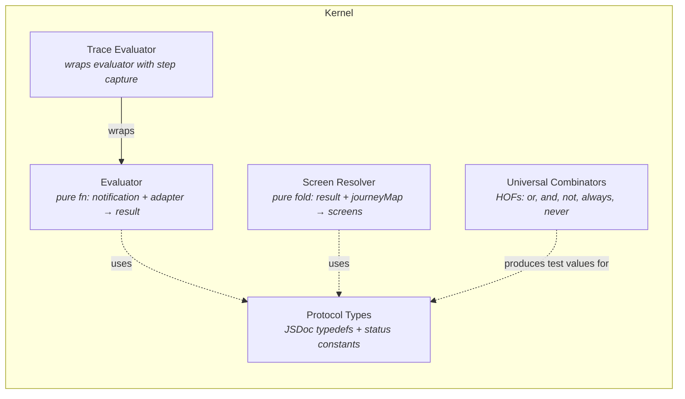
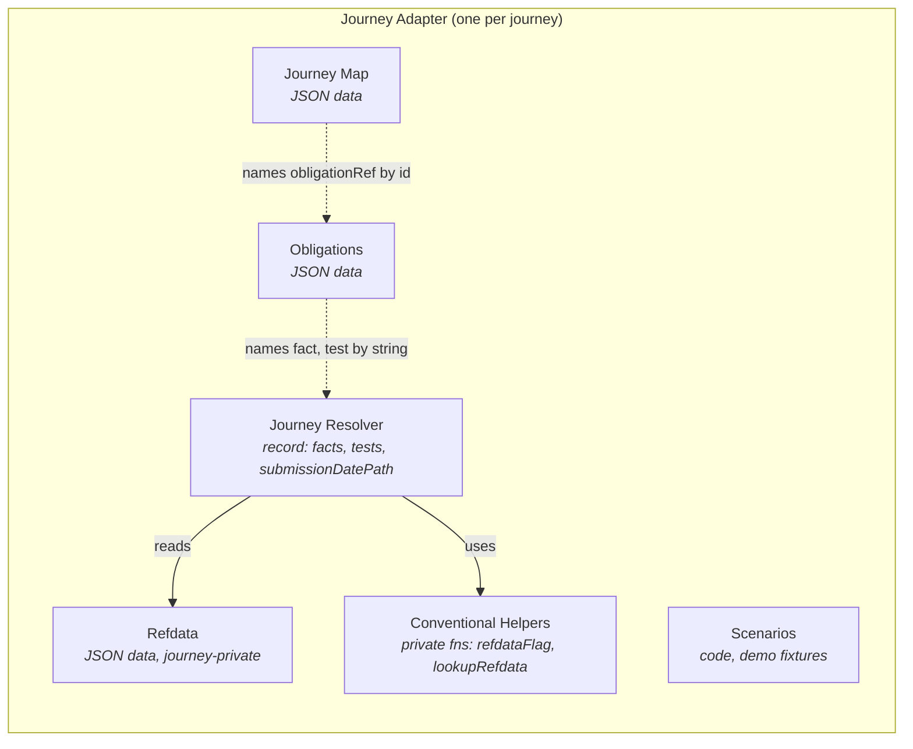
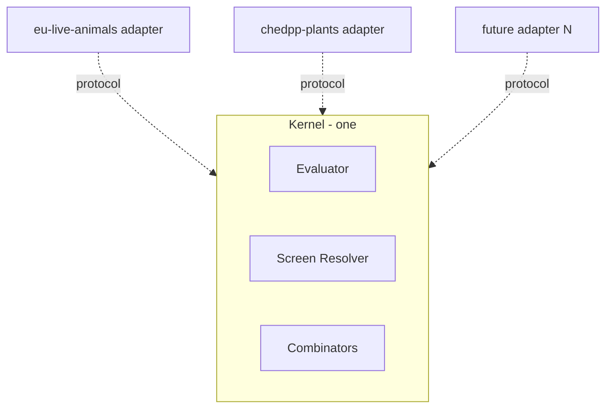
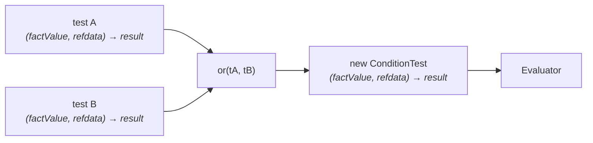
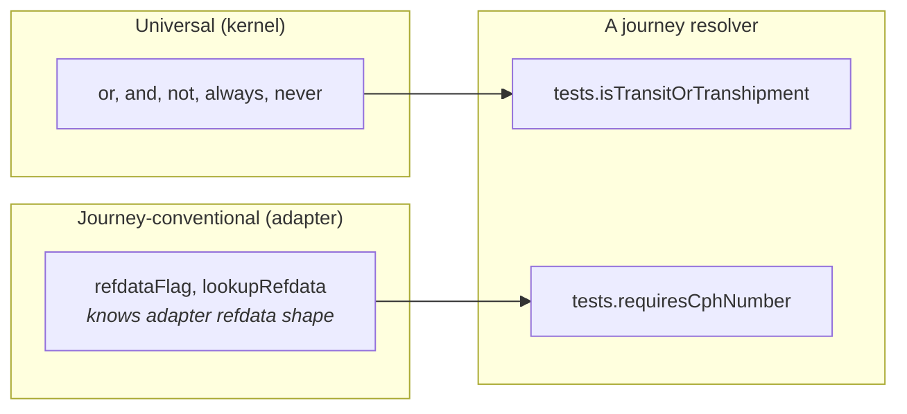
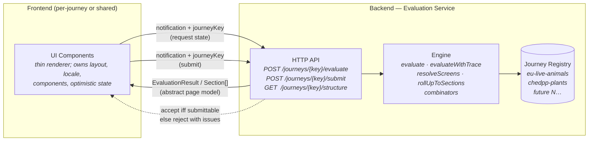

# Solution Overview — Journey Configuration

> First draft. Diagrams establish the working mental model; prose is
> deliberately thin. Phases 2–4 of the design conversation will deepen
> each section.

## 1. Core idioms (functional re-cast of classical patterns)

The patterns named earlier (Specification, Strategy, Plugin, Composite +
Visitor) are GoF / OO vocabulary. They identify *recurring problems* —
but their *idiomatic solutions* differ in FP. We keep the problems;
re-cast the idioms.

| OO pattern name | FP idiom we use | What it looks like in this codebase |
|---|---|---|
| Specification | **Declarative data + pure evaluator** | Obligations are plain JSON. The engine is a pure function that interprets them. No predicate classes. |
| Strategy | **Functions-as-values; dependency via parameters** | The journey resolver's `facts` and `tests` are records of functions. The kernel takes the record as a parameter. |
| Plugin / Kernel-and-plugins | **Pure module + adapter record** | The kernel exports pure functions. A journey adapter is a record (data + functions) passed in. No registration ceremony. |
| Composite + Visitor | **Recursive data + fold** | The journey map is a tree of plain objects. The screen resolver is a fold producing a new tree shape. |

A property worth pinning to: **data and functions are separate
citizens.** No data type carries methods. The engine's job is to apply
functions to data; the journey's job is to supply both. This is the
discipline that keeps the kernel pure and the adapter swappable.

## 2. Component view (C4 L3)

### 2.1 Kernel — schema-agnostic, journey-agnostic

Every kernel module is pure, framework-free, and has no knowledge of any
specific journey.

### 2.2 Adapter — one per journey

The adapter is the only place schema-specific knowledge lives.

## 3. Conceptual model (data shapes)

Records, not classes. No methods on data types — the engine supplies the
functions.

## 4. Flow — evaluating data against obligations

Inputs flow into the evaluator; the output is a set of obligation
statuses. The journey resolver is the only schema-aware participant.

## 5. Flow — mapping the page structure to screens

The journey map is the declarative *page structure*. The screen resolver
folds it with the evaluation result to produce concrete screens with
status.

## 6. Scaling — kernel + N adapters

Property: adding adapter *N* requires zero kernel change. The protocol
(Phase 2 deliverable) is what makes this true.

## 7. Crosscutting — combinators

Combinators are higher-order functions that take tests and return tests.
They preserve the `ConditionTest` contract, so the engine sees them as
ordinary tests.

Two tiers:

Universal combinators are protocol-only — they cannot peek at refdata
shape. Journey-conventional helpers are private to the adapter; they may
be promoted to the kernel only when a third journey shares the same
convention.

## 8. Deployment — Server-Driven UI (forward-looking)

When this work moves beyond the in-process spike to a real
frontend/backend split, the engine and journey adapters live behind
an HTTP boundary as a backend service. The frontend is a thin
renderer that asks the backend for the state it should display, and
the backend gates submission with the same engine that drove the
rendering. This is the **Server-Driven UI (SDUI)** pattern — see
prior art and published practice from Airbnb, Instagram, Spotify,
Lyft, and others on the same problem (conditional flows with strong
server-side validation).

Key properties this enables:

- **Single source of truth.** The engine that gates submission is the
  same engine that drives the UI's task list and screen variance.
  Drift between *what the backend will accept* and *what the frontend
  shows* is structurally impossible.
- **What crosses the wire is data, not rendering.** `Section[]` with
  `Screen[]` is the abstract page model — sections exist, screens
  carry status, fields name their obligation. The frontend owns
  components, layout, copy, locale, optimistic state. The backend
  owns the structure of *what is shown*.
- **Resolvers stay server-side.** Per `protocol.md` §5.6, the
  `JourneyResolver` contains functions; functions don't serialise. The
  journey's resolver code runs in the service. Clients only ever
  reference journeys by key.
- **Common capability across journeys.** One engine; many journey
  adapters; multiple frontend consumers (Animals UI, Plants UI,
  future N). New journeys plug into the same engine without code
  change to the engine itself.

What this section deliberately doesn't decide (parked for follow-on
design):

- Whether `resolveScreens` / `rollUpToSections` run server-side (the
  service returns `Section[]`) or client-side (the service returns
  `EvaluationResult` and the FE folds it against a separately-fetched
  `JourneyMap`). Both are protocol-consistent.
- Whether one service hosts many journeys, or each journey gets its
  own service (federated).
- Caching, versioning, audit-record shape, optimistic-state
  reconciliation. All real questions; none change the engine's
  protocol.
