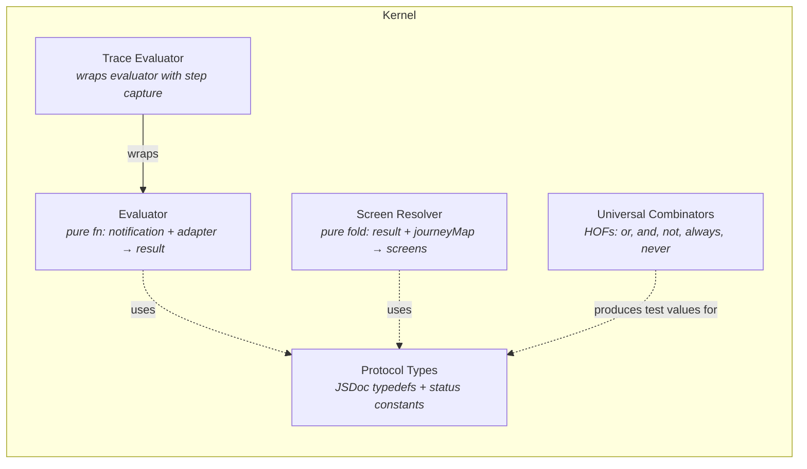
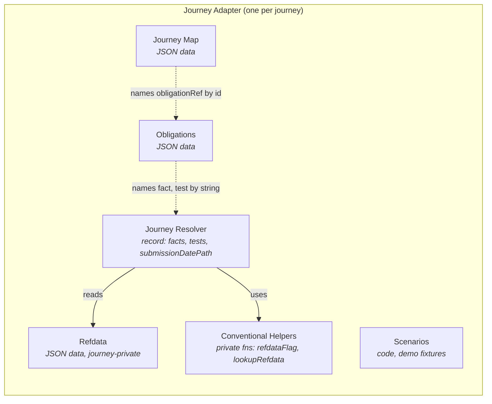
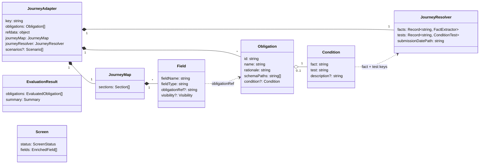
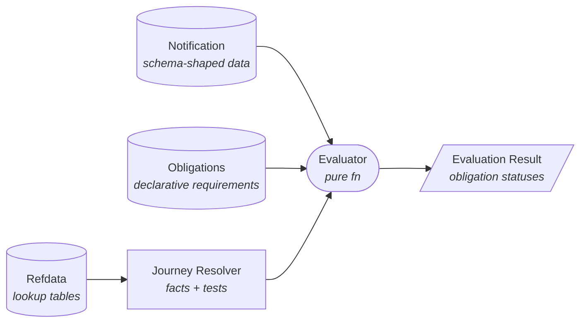
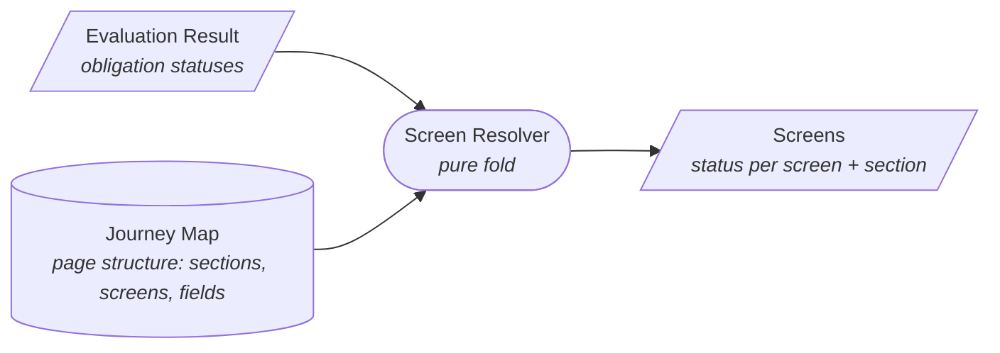
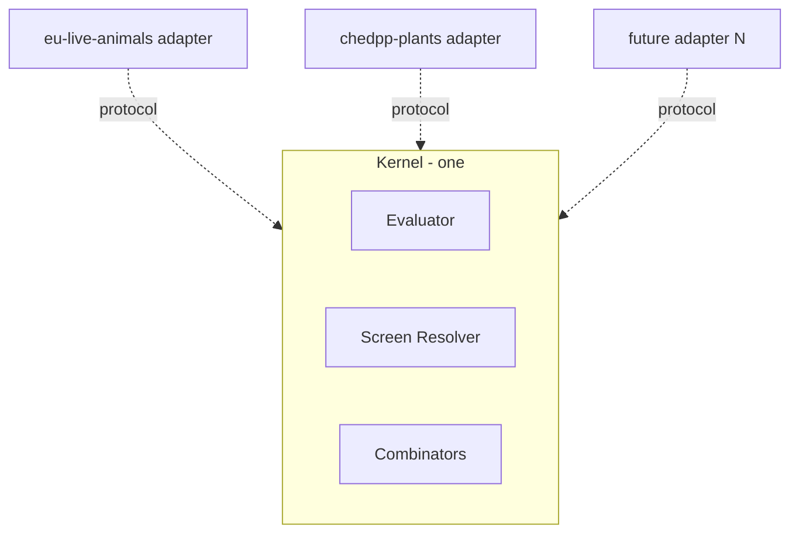
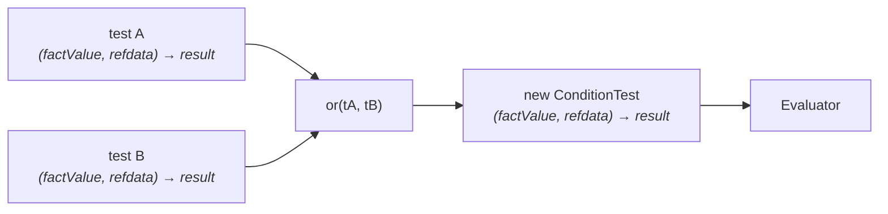
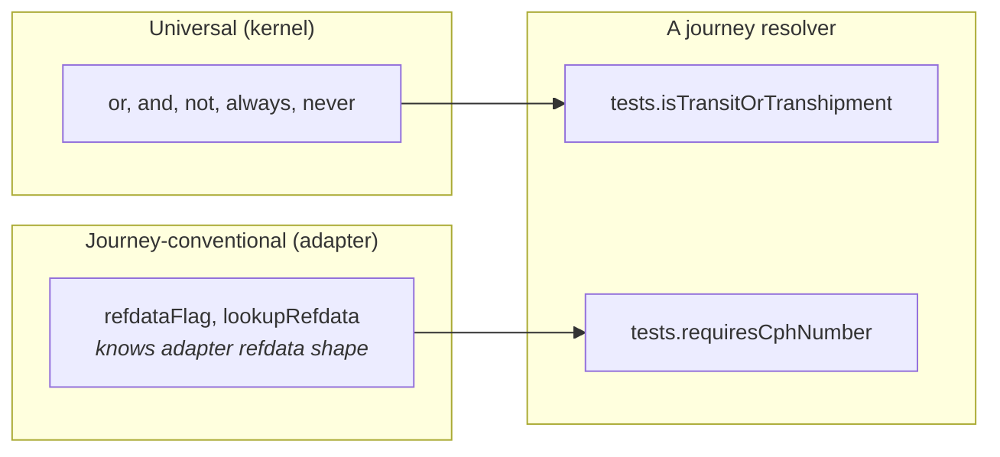
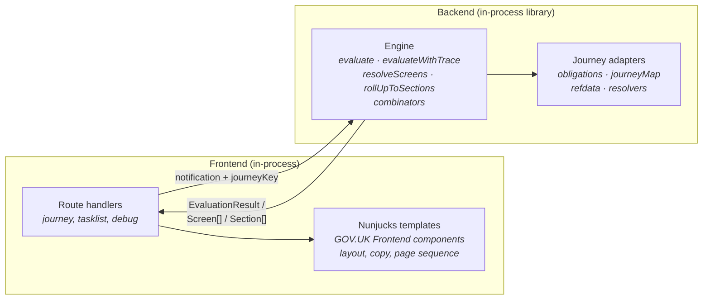

# Solution Overview — Journey Configuration

> First draft. Diagrams establish the working mental model; prose is
> deliberately thin. Phases 2–4 of the design conversation will deepen
> each section.

## 1. Core idioms (functional re-cast of classical patterns)

The patterns named earlier (Specification, Strategy, Plugin, Composite +
Visitor) are GoF / OO vocabulary. They identify *recurring problems* —
but their *idiomatic solutions* differ in FP. We keep the problems;
re-cast the idioms.

| OO pattern name | FP idiom we use | What it looks like in this codebase |
|---|---|---|
| Specification | **Declarative data + pure evaluator** | Obligations are plain JSON. The engine is a pure function that interprets them. No predicate classes. |
| Strategy | **Functions-as-values; dependency via parameters** | The journey resolver's `facts` and `tests` are records of functions. The kernel takes the record as a parameter. |
| Plugin / Kernel-and-plugins | **Pure module + adapter record** | The kernel exports pure functions. A journey adapter is a record (data + functions) passed in. No registration ceremony. |
| Composite + Visitor | **Recursive data + fold** | The journey map is a tree of plain objects. The screen resolver is a fold producing a new tree shape. |

A property worth pinning to: **data and functions are separate
citizens.** No data type carries methods. The engine's job is to apply
functions to data; the journey's job is to supply both. This is the
discipline that keeps the kernel pure and the adapter swappable.

## 2. Component view (C4 L3)

### 2.1 Kernel — schema-agnostic, journey-agnostic

Every kernel module is pure, framework-free, and has no knowledge of any
specific journey.

### 2.2 Adapter — one per journey

The adapter is the only place schema-specific knowledge lives.

## 3. Conceptual model (data shapes)

Records, not classes. No methods on data types — the engine supplies the
functions.

## 4. Flow — evaluating data against obligations

Inputs flow into the evaluator; the output is a set of obligation
statuses. The journey resolver is the only schema-aware participant.

## 5. Flow — mapping the page structure to screens

The journey map is the declarative *page structure*. The screen resolver
folds it with the evaluation result to produce concrete screens with
status.

## 6. Scaling — kernel + N adapters

Property: adding adapter *N* requires zero kernel change. The protocol
(Phase 2 deliverable) is what makes this true.

## 7. Crosscutting — combinators

Combinators are higher-order functions that take tests and return tests.
They preserve the `ConditionTest` contract, so the engine sees them as
ordinary tests.

Two tiers:

Universal combinators are protocol-only — they cannot peek at refdata
shape. Journey-conventional helpers are private to the adapter; they may
be promoted to the kernel only when a third journey shares the same
convention.

## 8. Architecture — the FE/BE seam

The protocol of §5 defines a logical separation of concerns between two
halves of the application:

**Backend** owns *what is true* about a notification: which obligations
are satisfied, which screens are complete, whether the notification is
submittable, what reference data applies. It is the engine + the
journey adapters + the refdata. It runs in-process today but is
deliberately framework-agnostic — pure functions, no Hapi imports — so
that the *what is true* logic is testable as a library.

**Frontend** owns *how the state is shown* and *how the user moves
through it*: which page renders which screen, the logical sequence and
routing between pages, component selection from GOV.UK Frontend, copy
and layout. It is the route handlers + the Nunjucks templates. The
sequence in which screens are presented to the user is an FE concern,
not encoded in the journey map's section order alone.

**The seam between them is the engine's output:** `EvaluationResult`,
`Screen[]`, `Section[]` (with the optional `trace` for diagnostics).
Nothing else crosses. The FE never inspects the journey map directly;
the engine resolves the map into screens with derived statuses and
hands the FE a flat render-ready model.

This is the *Server-Driven UI* pattern as a separation of concerns —
state lives behind one seam, rendering lives behind the other. Both
halves currently run in the same Hapi process; there is no HTTP / service
boundary and none is planned. The properties that earn this separation
are independent of where it deploys:

- **Single source of truth.** The same engine that drives the rendered
  task list and screen variance also gates submission. Drift between
  *what is accepted* and *what is shown* is structurally impossible
  because both paths terminate in the same `evaluate` /
  `resolveScreens` calls.
- **Common capability across journeys.** One engine; many journey
  adapters (today: `eu-live-animals`, `chedpp-plants`). New journeys
  plug into the registry without changes to the engine itself.
- **Independently testable halves.** The engine is unit-tested against
  fixtures with no Hapi setup; the templates and route handlers can
  evolve without re-deriving obligation logic.

The framework-isolation property (`engine/` has no Hapi imports) makes
the BE half a real library — usable wherever JS runs, easy to test in
isolation, hard to couple to the wrong thing by accident.
