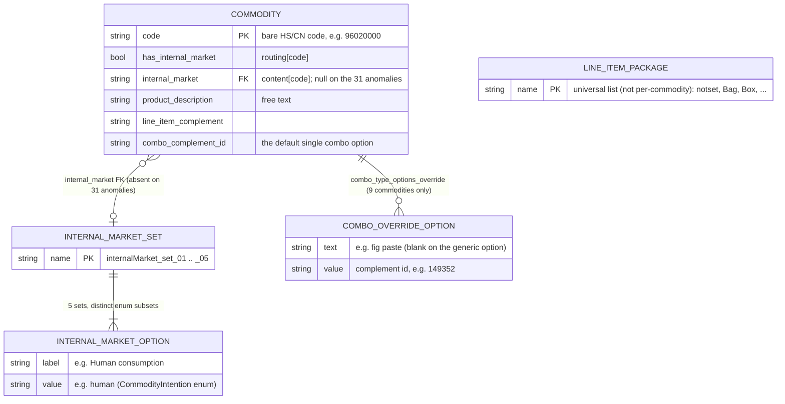
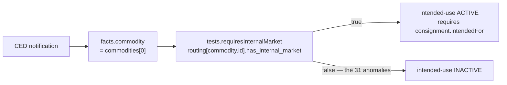

# CHED-D (chedd-products) journey

The journey adapter for IPAFFS **CHED-D / CED** — the Common Health Entry Document for **food and feed of non-animal origin** (rice, pasta, fruit pastes, oil seeds, spices, dried-fruit mixtures, and the like). It is the third registered journey, sitting beside `eu-live-animals` (CHED-A) and `chedpp-plants` (CHED-PP). The evaluation engine is journey-agnostic; this directory encapsulates everything CED-specific.

Files in this directory:

- `obligations.json` — the 18 obligations (one conditional).
- `resolvers.js` — fact extractors + condition tests; reads `refdata`.
- `journey.json` — screens / sections / field map (6 sections).
- `refdata.json` — per-commodity reference data. **Generated — do not hand-edit** (regenerate via `build-refdata.js`).
- `build-refdata.js` / `build-refdata.test.js` — the staging → refdata transform and its byte-identity verification.
- `refdata-view.js` — the explorer's commodity-config dimensions/details.
- `scenarios.js` / `scenarios.test.js` — committed scenarios + regression net.
- `index.js` — the module the engine imports.

The notification discriminator is `type: "CED"` (the IPAFFS `document_type`).

## What CHED-D is (and isn't)

CHED-D covers **non-animal** food and feed, so — unlike animals — it carries **no** veterinary/health-certificate, species-taxonomy, animal-identification, transporter, or CPH/holding obligations; and — unlike plants — **no** phytosanitary inspectorate or marketing-standard (GMS/SMS) machinery. The two things it adds that the other journeys lack:

- **"Intended for"** — a commodity destined for the GB internal market must declare its intended use: human consumption / feedingstuff / further process / other. This is the one **conditional** obligation, and the only real source of obligation variance in the journey.
- **Commodity complement ("combo")** — a per-line-item sub-classification of the commodity.

Everything else (origin, purpose, packages/weights, parties, documents, entry/arrival, contact, declaration) is the shared IPAFFS spine common to all three journeys.

## History of the dataset

The raw input was **2,176 CHED-D field configurations** — one per commodity (HS/CN) code, each a full IPAFFS PartOne form definition. A field-config analysis pipeline collapsed them into the committed **`features/chedd-config/chedd-products-staging.json`** (Part 1, `model: "pure-data"`, `version: 2.0`, `generated_at: 2024-06-09`). The pipeline's key act was to separate the **universal layer** from the **per-commodity layer** by diffing all 2,176 configs:

- **~30 universal components** — byte-identical across every commodity (country/region of origin, gross/net weights, package count, purpose, the party selectors `p_sel*`, accompanying-document fields, means-of-transport, seal/container, arrival/departure date-time). These carry no per-commodity information, so they become the **static journey screens** — not refdata.
- **7 varying components** — the only fields that actually differ:
  - `identificationCommodity` (I.12, per-commodity line-item weights)
  - `Product description` (I.12, a per-commodity `species_picker` — free text, despite the name)
  - `internalMarket` (I.18 "Commodity intended for", radio) — **set-based**: the 2,176 commodities share just **5 distinct option sets**
  - `comboType` / `comboClass` / `comboFamily` / `comboModel` (Consignment, per-commodity selects)

`build-refdata.js` (story 01) then projects the staging artifact into `refdata.json`: single-grain bare-code keys, fields renamed to snake_case, the **four** combo sub-selects collapsed to a single `combo_complement_id` (see "the combo" below), the 5 internal-market sets normalised, and each set option reduced to `{label, value}` (the field-config form-state — `editable/id/name/selected/visible` — is dropped). The transform is pure and deterministic: `_meta` carries the staging artifact's own `generated_at` rather than a wall-clock, so a fresh build is byte-identical to the committed file (the verification test pins this).

References: `features/chedd-config/01-refdata-transform.md` (transform), `features/notification-shape/04-migrate-chedd-products.md` (notification mapping).

## Data model (refdata.json)

`refdata.json` has three load-bearing sections plus `_meta`:

- `routing[code]` → `{ has_internal_market }` — the single routing flag (2,176 entries).
- `content[code]` → `{ internal_market?, product_description, line_item_complement, combo_complement_id, combo_type_options_override? }` (2,176 entries).
- `definitions.internal_market_sets` → the 5 named option sets; `definitions.line_item_packages` → the universal package list.



Notes on the diagram:

- `COMMODITY` is a logical entity. **Physically it is two parallel maps** — `routing[code]` and `content[code]` — keyed by the same bare code. The ERD merges them.
- `LINE_ITEM_PACKAGE` is **universal** (one shared list for all commodities), hence no relationship line — it is a standalone definition, like animals' identifier sets.
- The combo has no template entity: for the ~2,167 commodities without an override, the single combo option is reconstructed **at read time** from `combo_complement_id` (`{ text: '', value: combo_complement_id }`). Only the 9 outliers store an explicit option list.

### The part that catches people out: single-grain keys

Animals keys refdata on a second axis (`code|species`); CHED-D has **no species axis**, so it is **single-grain** — keyed by the **bare** commodity code. But the explorer's config routes call the view closures with a `` `${code}|` `` key (`config-routes.js` always appends `|`). So every closure in `refdata-view.js` strips it via `codeOf(key) = key.split('|')[0]`, while `resolvers.js` and `commodityDetail` look up the **raw** code with no `|`. Miss the `codeOf` strip and lookups silently return `[]`/`null` — a 200 with empty data, not a crash.

## Internal market & the `intendedFor` enum

`internalMarket` ("I.18 Commodity intended for") is a radio whose options map to the IPAFFS **`CommodityIntention`** enum — `human` / `feedingstuff` / `further` / `other` — written to **`consignment.intendedFor`** in the notification (a consignment-level field, sibling of the weight/package totals). It deliberately does **not** reuse `Purpose.internalMarketPurpose` (a different vocabulary with no `further` value) nor animals' `purpose.subPurpose`; CHED-D keeps a distinct path with distinct values. See `features/notification-shape/04-migrate-chedd-products.md`.

The 2,176 commodities share **5 distinct subsets** of that enum:

| Set                     | Options (`value`)                   |
| ----------------------- | ----------------------------------- |
| `internalMarket_set_01` | feedingstuff, further, human, other |
| `internalMarket_set_02` | human                               |
| `internalMarket_set_03` | feedingstuff, other                 |
| `internalMarket_set_04` | feedingstuff, human, other          |
| `internalMarket_set_05` | further, human, other               |

**31 anomaly commodities carry no internal-market set at all** (`content[code].internal_market` is absent). These are the commodities for which IPAFFS shows no "intended for" question — non-food items and feed preparations that never reach the GB internal market. For them the `intended-use` obligation is **inactive** (not unsatisfied), so a notification can omit `consignment.intendedFor` and still be submittable.

In the explorer the Internal market dimension renders each option as **`label (value)`** — e.g. `Human consumption (human)` — so the notification mapping is legible at a glance. The structured `{label, value}` stays available on the JSON API via `commodityDetail.internalMarketSet`.

## The combo, and the 9 overrides

A commodity's **combo** is its IPAFFS `CommodityComplement` — a sub-classification selected per line item, mapped to `commodities[].complementId` (+ `complementName`). The staging field config modelled it as **four** cascading selects (`comboType`/`comboClass`/`comboFamily`/`comboModel`), but the canonical `CommodityComplement` has a **single** `complementID`, so the transform models the combo as one complement, not four (this was an explicit de-modelling decision — see `04-migrate-chedd-products.md`, R2).

For all but 9 commodities the combo is therefore a single value (`combo_complement_id`), reconstructed into one option at read time. The **9 outliers** carry an explicit `combo_type_options_override` — a real multi-way choice the single-template form can't represent. They exist because these are nearly all **broad or residual commodity codes** ("other", "not elsewhere specified", "mixtures") where one CN code spans several specific products that border control must disambiguate — each constituent has its own origin/risk profile, so IPAFFS asks _which_:

| Commodity  | Opts | Product (CN heading)           | Override options                                               |
| ---------- | ---- | ------------------------------ | -------------------------------------------------------------- |
| `200710`   | 3    | Homogenised jams/purées        | fig / hazelnut / pistachio paste                               |
| `200799`   | 3    | Other jams/purées              | fig / hazelnut / pistachio paste                               |
| `200819`   | 3    | Prepared fruit & nuts          | figs / hazelnuts / pistachios (prepared)                       |
| `081350`   | 5    | Dried fruit & nut **mixtures** | Brazil nuts in shell / almonds / figs / hazelnuts / pistachios |
| `12079996` | 2    | Other oil seeds (**residual**) | _(blank / generic)_ / Watermelon (egusi) seeds                 |
| `14049000` | 2    | Vegetable products **n.e.s.**  | _(blank / generic)_ / Betel leaves                             |
| `1902`     | 1    | Pasta                          | Dried Noodles                                                  |
| `100630`   | 1    | Milled rice                    | Basmati rice for direct human consumption                      |
| `09109105` | 1    | Spices (residual)              | Chilli products (curry)                                        |

Each option's `value` is a distinct complement id (e.g. `149352` = fig paste). The two `(blank)` options are the generic/unspecified fallback alongside a specific named product — which is why `comboType`'s display falls back from `text` to the complement id when `text` is empty.

Honest caveat: the three **1-option** overrides (`1902`, `100630`, `09109105`) are structurally identical to a plain single-template commodity — they are overrides only because the source config carried a bespoke label rather than the generic template. So **"9 overrides"** means "9 commodities the pipeline could not fold into the universal combo template"; only **6** of them offer a genuine multi-way choice.

## Obligations & evaluation

18 obligations (`obligations.json`): **17 unconditional** + **1 conditional** (`intended-use`). The unconditional set is the shared IPAFFS spine plus CHED-D's `commodity-complement` (the combo) and `packages-and-weights`. The single conditional obligation is the journey's only obligation-graph variance:



`resolvers.js`:

- `facts.commodity` — the **first** commodity (`commodities[0]`). Single-commodity routing semantic; multi-commodity routing is deferred (mirrors animals/plants).
- `tests.requiresInternalMarket(commodity, refdata)` — reads `routing[commodity.id].has_internal_market`. Bare-code lookup, **no `|` fallback**.
- `submissionDatePath` — `submittedAt` (the path `legal-declaration` stamps on submit).

A notification is **submittable** when every _active_ obligation is satisfied (`unsatisfied: 0`, `deferred: 0`). Because the 31 anomalies make `intended-use` inactive rather than unsatisfied, an anomaly notification that omits `consignment.intendedFor` is still submittable — the regression net pins exactly this (see scenarios below).

## Screens (journey.json)

6 sections. The journey map owns **presentation only**; schema paths and conditions live on the obligations. Screen visibility is **emergent** — if all of a screen's fields' obligations are inactive, the runtime skips the screen (there is no `dependsOn`).

| #   | Section                  | Screens                                                                       | Notable fields → obligation                                                                                                                                                                                              |
| --- | ------------------------ | ----------------------------------------------------------------------------- | ------------------------------------------------------------------------------------------------------------------------------------------------------------------------------------------------------------------------ |
| 01  | About                    | What are you importing · Origin · Reason                                      | cert-type → `notification-type`; origin country/region → `consignment-origin`; local ref → `reference-number`; purpose → `import-purpose`                                                                                |
| 02  | Description of the goods | Search commodities · Commodity details _(per commodity)_ · Consignment totals | commodity search → `commodity-selection`; product description → `commodity-description`; complement → `commodity-complement`; **intended-for → `intended-use` (conditional)**; weights/packages → `packages-and-weights` |
| 03  | Documents                | Accompanying documents _(per document)_                                       | type/reference/date/attachment → `accompanying-documents`                                                                                                                                                                |
| 04  | Addresses                | Consignor · Consignee · Importer · Place of destination                       | each an `address_group` → `consignor-`/`consignee-`/`importer-`/`destination-identification`                                                                                                                             |
| 05  | Transport                | Entry point and arrival                                                       | point of entry / arrival date / arrival time → `entry-and-arrival`; means of transport → `transport-to-port`                                                                                                             |
| 06  | Complete notification    | Contact address · Declaration                                                 | contact → `contact-designation`; declaration → `legal-declaration`                                                                                                                                                       |

The **intended-for** field on screen 02-02 is the visible face of the conditional `intended-use` obligation: on an anomaly commodity the obligation is inactive, so the field's question simply does not apply.

## Scenarios & how to scrutinise

Six committed scenarios in `scenarios.js` (`scenarioMap`) cover the food families, the anomaly path, the combo outlier, and the multi-commodity case. The pinned `(satisfied, inactive)` counts make the conditional explicit — internal-market commodities run all 18 obligations active (18/0); anomalies run 17 with `intended-use` inactive (17/1):

| Scenario                    | Commodity         | satisfied / inactive | Note                                         |
| --------------------------- | ----------------- | -------------------- | -------------------------------------------- |
| `import-wheat`              | `1001`            | 18 / 0               | internal market active; richest path         |
| `import-feed-prep`          | `230990`          | 17 / 1               | anomaly (animal feed prep)                   |
| `import-refrigerator`       | `84181020`        | 17 / 1               | anomaly (non-food)                           |
| `import-fruit-paste`        | `200710`          | 18 / 0               | combo-override outlier + internal market     |
| `import-preserved-apricots` | `08129025`        | 17 / 1               | a second anomaly family                      |
| `import-mixed`              | `1001` + `200710` | 18 / 0               | multi-commodity; routing driven by the first |

Programmatic scrutiny:

```bash
TZ=UTC PORT=3001 npx vitest run src/server/journeys/chedd-products/
```

Visual scrutiny in the explorer: from any explorer page use the **journey picker** in the nav to switch to `chedd-products`; the scenario dropdown reloads with the CHED-D scenarios. Or boot it as the default with `JOURNEY=chedd-products npm run dev`, then walk `commodity-config` for `1001` (internal market), `84181020` (anomaly, no set), and `200710` (combo outlier).
