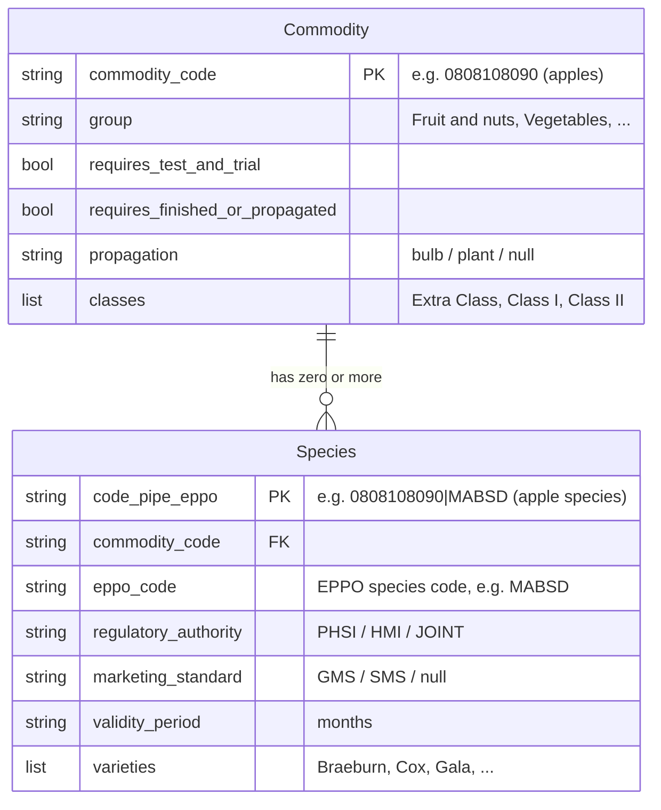

# Plants (CHEDPP) journey: domain reference

Reference documentation for the data model, source tables, and rules that drive the `chedpp-plants` journey.

## What CHEDPP is

CHEDPP stands for Common Health Entry Document for Plants and Plant Products. It is the IPAFFS notification type used to declare imports of regulated plants, plant produce, and related goods into Great Britain. IPAFFS (the Import of Products, Animals, Food and Feed System) is the Defra service that issues, validates, and tracks these notifications.

A CHEDPP notification names one or more commodities, each identified by an 8-digit commodity code (e.g. `0808108090` for fresh apples), and for each commodity the species being imported, identified by EPPO codes (`MABSD` for Braeburn apples). EPPO is the European and Mediterranean Plant Protection Organization, which publishes a standard naming scheme for plant species.

Three regulatory authorities can be involved in inspecting a CHEDPP import:

- `PHSI` (Plant Health and Seeds Inspectorate). The default authority for plant-health checks. Most species fall here.
- `HMI` (Horticultural Marketing Inspectorate). Involved when produce is subject to marketing standards.
- `JOINT`. Both PHSI and HMI involved.

When HMI is involved, the produce is checked against a marketing standard:

- `GMS` (General Marketing Standard).
- `SMS` (Specific Marketing Standard) for certain fruit and vegetable categories.

The `chedpp-plants` journey models the data and rules needed to drive its obligations and scenarios. The rest of this document describes that model precisely.

## The plants data model

Two kinds of fact about plant imports, separated by what they describe:



A commodity has zero or more species, and that difference is meaningful. Two concrete cases:

- **Apples** (`0808108090`, in the Fruit and nuts group) ship with two species rows: `MABSD` (*Malus domestica*, the cultivated apple, with 67 recorded varieties including Braeburn, Cox, Gala, Pink Lady), and `MABSS` (other *Malus* species, with two varieties).
- **Wheat seed for sowing** (`10011100`, in the Seed & Tissue Culture group) ships with zero species rows.

The first is read straightforwardly: look up `species["0808108090|MABSD"]` and consume the fields. The second is read by absence: no species rows for this commodity means PHSI authority with no marketing standard. Absence is the signal; nothing is defaulted in the data file.

Which fact describes what:

| Fact | Describes | Effect when consumed |
| --- | --- | --- |
| `group` | commodity | Commodity group (Vegetables, Fruit and nuts, Plants for Planting, etc.). 11 groups in total. |
| `requires_test_and_trial` | commodity | A field on the IPAFFS bulk-details page. |
| `requires_finished_or_propagated` | commodity | A dropdown on the IPAFFS bulk-details page. |
| `propagation` | commodity | `bulb` or `plant`. Routes to intended-use sub-journeys. |
| `classes` | commodity | Quality classes (`Extra Class`, `Class I`, `Class II`). Combined with `varieties` to drive the variety/class selection page. |
| `regulatory_authority` | species | `PHSI`, `HMI`, or `JOINT`. Drives the GMS-declaration page and the customs document code on the review page. |
| `marketing_standard` | species | `GMS` or `SMS`. Combined with `regulatory_authority === HMI` triggers the GMS declaration. See "The GMS-declaration predicate" below. |
| `validity_period` | species | Months. Used in the certificate validity calculation. |
| `varieties` | species | Permitted varieties (e.g. apple cultivars). Combined with `classes` triggers variety/class selection. |

The composite species key `commodity_code|eppo_code` is the same string shape the upstream microservice uses as an API query parameter. The `|` separator is preserved verbatim so a grep against `species["0808108090|MABSD"]` matches the same string an integration might pass on the wire.

## What each fact drives in the real IPAFFS journey

The CHEDPP notification journey in IPAFFS is roughly 15 pages of conditional content driven by per-handler logic and routing tables. `chedpp-plants` models the data variance those pages depend on so that an obligations engine can reason about them. It does not reproduce the full page sequence.

The effects in the table above are observable in the IPAFFS notification frontend's handler code. Pages whose behaviour is fully determined by optional commodity fields and not yet expressed as an obligation are still represented in the data file when the fact was available, because adding the obligation later is the cheaper change.

## What is and is not stored in `refdata.json`

The shape of `refdata.json` mirrors the upstream microservice's database tables: each fact is stored once, at the level that describes it (commodity or species). The map for commodity-level facts is `commodities`; the map for species-level facts is `species`.

Some fields that consumers compute from stored facts are deliberately not in the file, because storing them would either duplicate data or encode logic as data:

- `has_gms` is derived at read time from `regulatory_authority` and `marketing_standard` using the predicate cited under "The GMS-declaration predicate" below. Storing it would encode the predicate twice.
- `has_varieties` is `(varieties?.length ?? 0) > 0`. Pure derivation; no reason to store it.
- `requires_billing` is "true when a species row exists, false otherwise." A rule, not a fact about the commodity.
- The three commodity-level flags (`requires_test_and_trial`, `requires_finished_or_propagated`, `propagation`) live on the commodity record, not on every species row. A commodity with 75 species stores each flag once, not 75 times.

The clearest illustration is the per-species flag duplication that an unnormalised shape produces:

```
Unnormalised (one row per species, commodity-level facts duplicated):
{
  "0808108090|MABSD": { ..., requires_test_and_trial: false,
                             requires_finished_or_propagated: false,
                             propagation: null, ... },
  "0808108090|MABDO": { ..., requires_test_and_trial: false,
                             requires_finished_or_propagated: false,
                             propagation: null, ... },
  ... 73 more apple species, same three fields repeated ...
}

Normalised (commodity-level facts stored once):
commodities["0808108090"] = { requires_test_and_trial: false,
                              requires_finished_or_propagated: false,
                              propagation: null, ... }
species["0808108090|MABSD"] = { ... no duplicated flags ... }
species["0808108090|MABDO"] = { ... no duplicated flags ... }
```

The current file is the normalised form on the right.

## The plants `refdata.json` shape

The file `src/server/journeys/chedpp-plants/refdata.json` ships two top-level maps under a `_meta` provenance block:

```jsonc
{
  "_meta": {
    "generated": "...",
    "counts": { "commodities": 521, "species": 5321,
                "commodities_with_classes": 25 },
    "source": { ... },
    "description": "..."
  },
  "commodities": {
    "0808108090": {
      "requires_test_and_trial": false,
      "requires_finished_or_propagated": false,
      "propagation": null,
      "group": "Fruit and nuts",
      "classes": ["Extra Class", "Class I", "Class II"]
    }
    // ... 520 more commodity codes
  },
  "species": {
    "0808108090|MABSD": {              // Malus domestica (cultivated apple)
      "regulatory_authority": "JOINT",
      "marketing_standard": "SMS",
      "validity_period": "7",
      "varieties": ["Braeburn", "Bramley", "Cox's Orange Pippin",
                    "Gala", "Granny Smith", "Pink Lady" /* ... 61 more */]
    }
    // ... 5,320 more (commodity, species) entries
  }
}
```

The apples entry above carries marketing data but does not trigger the GMS-declaration page, because the rule requires `HMI` AND `GMS` and this species is `JOINT + SMS`. A species that does trigger the page is `0805108010|XXXXX` (sweet oranges, `HMI + GMS`). See "The GMS-declaration predicate" below.

The map keys serve as both lookup keys and identity:

- `commodities[code]` is one entry per commodity code (8 digits).
- `species[code|eppo]` is one entry per (commodity, species) pair, keyed by the pipe-separated composite the upstream API uses.

PHSI-only commodities have an entry under `commodities` but no entries under `species`. The shipped `species` map contains 5,321 entries: exactly the union of HMI (447) and JOINT (4,874) pairs. The 480,505 PHSI-only pairs in the source `inspection_responsibility` table are deliberately absent; see "Scale and distribution" below.

The source data comes from seven tables in the upstream `ipaffs-commoditycode-microservice`:

| Source table | Contributes |
| --- | --- |
| `inspection_responsibility` | `regulatory_authority` per `(commodity, species)` |
| `hmi_marketing` | `marketing_standard`, `validity_period` per `(commodity, species)` |
| `commodity_eppo_variety` | `varieties` per `(commodity, species)` |
| `commodity_group_commodity` | `group` per commodity |
| `commodity_configuration` | `requires_test_and_trial`, `requires_finished_or_propagated` per commodity |
| `commodity_attributes` | `propagation` per commodity |
| `commodity_class` | `classes` per commodity |

## Scale and distribution (production data)

The point of this section is the skew. The regulatory complexity that gives CHEDPP its character applies to a tiny minority of the source rows. Three orders of magnitude separate the dominant default (PHSI-only species, the trivial case) from the rare case that triggers the GMS-declaration page.

| Dimension | Production count |
| --- | --- |
| Distinct commodity codes in `commodity_group_commodity` | 482 |
| Distinct commodity codes in `inspection_responsibility` | 389 |
| Union of the two (what `commodities` ships) | 521 |
| `(commodity, species)` pairs in `inspection_responsibility` | ~486,000 |
| PHSI-only pairs | 480,505 (98.9%) |
| JOINT pairs | 4,874 (1.0%) |
| HMI pairs | 447 (0.1%) |
| Pairs carrying marketing data (HMI + JOINT) | 5,321 (1.1%) |
| Pairs that trigger GMS declaration (HMI AND GMS) | 409 (0.08%) |
| Pairs carrying variety data | 86 across 37 commodity codes |

Three numbers in this table shape the file and the resolver:

- **~486,000 source pairs, 99% PHSI-only.** The trivial case dominates. Triggering none of CHEDPP's complex sub-journeys (GMS declaration, variety/class selection) is the common path, not the exception.
- **5,321 marketing-bearing pairs = HMI (447) + JOINT (4,874).** The `species` map in `refdata.json` ships exactly this number, no more, no less. The 480,505 PHSI-only pairs are represented by absence: a commodity with no species entries is read as PHSI-only with no marketing standard. The design choice of "absence is the signal" collapses the file size by roughly 90x without losing any variance signal the resolver needs.
- **409 pairs trigger GMS declaration (0.08% of the source).** The GMS-declaration page is one of the most visible CHEDPP-specific artefacts, yet it fires on fewer than one in a thousand source rows. The predicate must be correct; the path is rare.

That 1.1% of marketing-bearing pairs lives almost entirely in two of the eleven commodity groups:

| Group | Codes | PHSI only | HMI only | JOINT only | Mixed |
| --- | --- | --- | --- | --- | --- |
| Vegetables | 105 | 36 | 11 | 43 | 1 |
| Fruit and nuts | 96 | 16 | 26 | 40 | 1 |
| Seed & Tissue Culture | 99 | 79 | 1 | 7 | - |
| Plants for Planting | 65 | 36 | 3 | 15 | - |
| Wood and articles of wood | 82 | - | - | - | - |
| Machinery and vehicles | 26 | 26 | - | - | - |
| Cut Flowers | 10 | 10 | - | - | - |
| Grain | 17 | 14 | - | - | - |
| Foliage | 3 | 3 | - | - | - |
| Other vegetable products | 21 | - | - | - | - |
| Other | 2 | - | - | - | - |

Rows where the four authority columns are all `-` (Wood, Machinery, Cut Flowers ... and so on for the all-PHSI groups) split into two shapes: groups whose commodities appear under `inspection_responsibility` and are entirely PHSI (Machinery, Cut Flowers, Foliage, Grain), and groups with no species mappings in the source table at all (Wood, Other vegetable products, Other).

The naming of the groups is misleading on first read. "Plants for Planting" and "Seed & Tissue Culture" sound like they should be the regulatory centre, but they are overwhelmingly PHSI: 79 of 99 Seed & Tissue Culture codes are PHSI-only, and 36 of 65 Plants for Planting codes are. The HMI/JOINT marketing-standards complexity lives in **produce destined for consumption** - Fruit and nuts (80 of 96 codes carry HMI or JOINT marking) and Vegetables (55 of 105 do). Plants imported as plants attract phytosanitary checks but not marketing inspections; fruit and vegetables imported as food attract both.

The design consequences are concrete:

- **Test scenarios that exercise the GMS-declaration predicate or the variety/class selection must come from Fruit and Vegetables.** Scenarios drawn from Plants for Planting, Seed, Cut Flowers, Foliage, Wood, or Machinery exercise only the trivial PHSI path. Coverage of the rare-but-important cases is therefore deliberately concentrated in produce scenarios in `scenarios.js`.
- **The `species` map's keying is justified by the distribution, not the other way round.** A naive flat table would store all ~486,000 pairs; the two-map shape (commodity / species, with absence meaning PHSI) drops the file to ~6,000 entries without losing any variance signal. The distribution is what makes that trade work.
- **The Mixed column is almost empty** (2 commodities total). In practice almost every commodity carries a uniform authority across its species. The any-species aggregation in the GMS predicate is therefore mostly redundant for single-commodity notifications - it is required by the IPAFFS spec but rarely changes the answer.

## The GMS-declaration predicate

A CHEDPP notification triggers a GMS-declaration page when **any species on the notification has `regulatory_authority === HMI` AND `marketing_standard === GMS`**. The rule is cited verbatim from the IPAFFS notification frontend at `ipaffs-frontend-notification/service/src/utils/chedpp.js` lines 21-28:

```javascript
const requiresGmsConfirmation = commodities => {
  const complementParameterSets = _.get(commodities, 'complementParameterSet', [])
  return complementParameterSets.filter(complementParameterSet => _.get(complementParameterSet, 'keyDataPair', []).some(
    keyDataPair => keyDataPair.key === REGULATORY_AUTHORITY && keyDataPair.data ===
          regulatoryAuthorities.HMI) &&
      complementParameterSet.keyDataPair.some(keyDataPair => keyDataPair.key === MARKETING_STANDARD && keyDataPair.data ===
          marketingStandards.GMS)).length > 0
}
```

Two things to read off this code:

- **Aggregation is any-species.** The `filter(...).length > 0` walks every species on the notification; one qualifying species turns the page on. Not per-commodity.
- **Both conditions are required.** HMI alone does not trigger; GMS alone does not trigger. Both must be present on the same species.

The predicate is implemented in `src/server/journeys/chedpp-plants/resolvers.js`, reading `regulatory_authority` and `marketing_standard` directly from the species entry in `refdata.json` and applying the same AND.

## What is intentionally not in `refdata.json`

- **PHSI-only species rows.** A commodity with no species entries means PHSI-only. The 480,505 rows add no variance and would inflate the file roughly 90x for no gain.
- **Article 72 low-risk data.** Present in the broader microservice (a separate ~2,100-row table mapping low-risk commodities to species); not consumed by any current obligation, so not modelled. If a future obligation needs Article 72 routing, this is where to add it.

## Quirks worth flagging

- **Predicate applied to a single commodity.** The IPAFFS rule (cited above) is any-species across all commodities on a notification. The resolver here applies the predicate to `commodities[0]` only. For single-commodity notifications the two are equivalent. A real multi-commodity notification could carry a qualifying species on a later commodity that the resolver would miss.

- **`scenarios.js` `APPLES` comment.** The committed apples scenario's docstring describes apples as "an HMI commodity," but the species the scenario points at (`0808108090|MABSD`) is `JOINT + SMS` in `refdata.json`. The comment does not affect any test; it is wrong and worth correcting the next time the scenarios file is touched.
