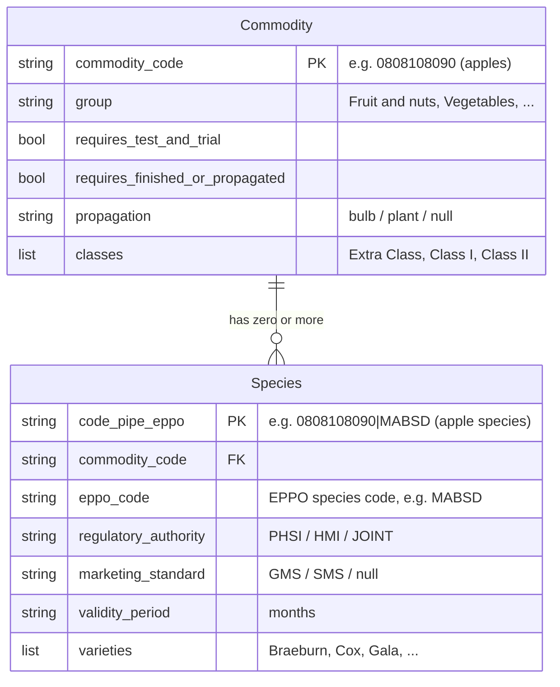

# Plants (CHEDPP) journey: domain reference

Reference documentation for the data model and rules that drive the
`chedpp-plants` journey.

## What CHEDPP is

CHEDPP stands for Common Health Entry Document for Plants and Plant
Products. It is the IPAFFS notification type used to declare imports of
regulated plants, plant produce, and related goods into Great Britain.
IPAFFS (the Import of Products, Animals, Food and Feed System) is the Defra
service that issues, validates, and tracks these notifications.

A CHEDPP notification names one or more commodities, each identified by an
8-digit commodity code (e.g. `0808108090` for fresh apples), and for each
commodity the species being imported, identified by EPPO codes (`MABSD` for
Braeburn apples). EPPO is the European and Mediterranean Plant Protection
Organization, which publishes a standard naming scheme for plant species.

Three regulatory authorities can be involved in inspecting a CHEDPP import:

- `PHSI` (Plant Health and Seeds Inspectorate). The default authority for
  plant-health checks. Most species fall here.
- `HMI` (Horticultural Marketing Inspectorate). Involved when produce is
  subject to marketing standards.
- `JOINT`. Both PHSI and HMI involved.

When HMI is involved, the produce is checked against a marketing standard:

- `GMS` (General Marketing Standard).
- `SMS` (Specific Marketing Standard) for certain fruit and vegetable
  categories.

The `chedpp-plants` journey models the data and rules needed to drive its
obligations and scenarios. The rest of this document describes that model
precisely.

## The plants data model

Two kinds of fact about plant imports, separated by what they describe:



A commodity has zero or more species, and that difference is meaningful.
Two concrete cases:

- **Apples** (`0808108090`, in the Fruit and nuts group) ship with two
  species rows: `MABSD` (_Malus domestica_, the cultivated apple, with 67
  recorded varieties including Braeburn, Cox, Gala, Pink Lady), and `MABSS`
  (other _Malus_ species, with two varieties).
- **Wheat seed for sowing** (`10011100`, in the Seed & Tissue Culture group)
  ships with zero species rows.

The first is read straightforwardly: look up `species["0808108090|MABSD"]`
and consume the fields. The second is read by absence: no species rows for
this commodity means PHSI authority with no marketing standard. Absence is
the signal; nothing is defaulted in the data file.

Which fact describes what:

| Fact                              | Describes | Effect when consumed                                                                                                                  |
| --------------------------------- | --------- | ------------------------------------------------------------------------------------------------------------------------------------- |
| `group`                           | commodity | Commodity group (Vegetables, Fruit and nuts, Plants for Planting, etc.). 11 groups in total.                                          |
| `requires_test_and_trial`         | commodity | A field on the IPAFFS bulk-details page.                                                                                              |
| `requires_finished_or_propagated` | commodity | A dropdown on the IPAFFS bulk-details page.                                                                                           |
| `propagation`                     | commodity | `bulb` or `plant`. Routes to intended-use sub-journeys.                                                                               |
| `classes`                         | commodity | Quality classes (`Extra Class`, `Class I`, `Class II`). Combined with `varieties` to drive the variety/class selection page.          |
| `regulatory_authority`            | species   | `PHSI`, `HMI`, or `JOINT`. Drives the GMS-declaration page and the customs document code on the review page.                          |
| `marketing_standard`              | species   | `GMS` or `SMS`. Combined with `regulatory_authority === HMI` triggers the GMS declaration. See "The GMS-declaration predicate" below. |
| `validity_period`                 | species   | Months. Used in the certificate validity calculation.                                                                                 |
| `varieties`                       | species   | Permitted varieties (e.g. apple cultivars). Combined with `classes` triggers variety/class selection.                                 |

The composite species key `commodity_code|eppo_code` is the same string
shape used for species lookups. The `|` separator is preserved verbatim so a
grep against `species["0808108090|MABSD"]` matches the same string an
integration might pass on the wire.

## What each fact drives in the real IPAFFS journey

The CHEDPP notification journey in IPAFFS is a multi-page conditional flow.
`chedpp-plants` models the data variance those pages depend on so that an
obligations engine can reason about them. It does not reproduce the full
page sequence.

Pages whose behaviour is fully determined by optional commodity fields and
not yet expressed as an obligation are still represented in the data file
when the fact was available, because adding the obligation later is the
cheaper change.

## What is and is not stored in `refdata.json`

Each fact is stored once, at the level that describes it (commodity or
species). The map for commodity-level facts is `commodities`; the map for
species-level facts is `species`.

Some fields that consumers compute from stored facts are deliberately not in
the file, because storing them would either duplicate data or encode logic
as data:

- `has_gms` is derived at read time from `regulatory_authority` and
  `marketing_standard` using the predicate under "The GMS-declaration
  predicate" below. Storing it would encode the predicate twice.
- `has_varieties` is `(varieties?.length ?? 0) > 0`. Pure derivation; no
  reason to store it.
- `requires_billing` is "true when a species row exists, false otherwise."
  A rule, not a fact about the commodity.
- The three commodity-level flags (`requires_test_and_trial`,
  `requires_finished_or_propagated`, `propagation`) live on the commodity
  record, not on every species row. A commodity with 75 species stores each
  flag once, not 75 times.

The clearest illustration is the per-species flag duplication that an
unnormalised shape produces:

```
Unnormalised (one row per species, commodity-level facts duplicated):
{
  "0808108090|MABSD": { ..., requires_test_and_trial: false,
                             requires_finished_or_propagated: false,
                             propagation: null, ... },
  "0808108090|MABDO": { ..., requires_test_and_trial: false,
                             requires_finished_or_propagated: false,
                             propagation: null, ... },
  ... 73 more apple species, same three fields repeated ...
}

Normalised (commodity-level facts stored once):
commodities["0808108090"] = { requires_test_and_trial: false,
                              requires_finished_or_propagated: false,
                              propagation: null, ... }
species["0808108090|MABSD"] = { ... no duplicated flags ... }
species["0808108090|MABDO"] = { ... no duplicated flags ... }
```

The current file is the normalised form on the right.

## The plants `refdata.json` shape

The file `src/server/journeys/chedpp-plants/refdata.json` ships two
top-level maps under a `_meta` provenance block:

```jsonc
{
  "_meta": {
    "generated": "...",
    "counts": { "commodities": 521, "species": 5321,
                "commodities_with_classes": 25 },
    "source": { ... },
    "description": "..."
  },
  "commodities": {
    "0808108090": {
      "requires_test_and_trial": false,
      "requires_finished_or_propagated": false,
      "propagation": null,
      "group": "Fruit and nuts",
      "classes": ["Extra Class", "Class I", "Class II"]
    }
    // ... more commodity codes
  },
  "species": {
    "0808108090|MABSD": {              // Malus domestica (cultivated apple)
      "regulatory_authority": "JOINT",
      "marketing_standard": "SMS",
      "validity_period": "7",
      "varieties": ["Braeburn", "Bramley", "Cox's Orange Pippin",
                    "Gala", "Granny Smith", "Pink Lady" /* ... 61 more */]
    }
    // ... more (commodity, species) entries
  }
}
```

The apples entry above carries marketing data but does not trigger the
GMS-declaration page, because the rule requires `HMI` AND `GMS` and this
species is `JOINT + SMS`. A species that does trigger the page is
`0805108010|XXXXX` (sweet oranges, `HMI + GMS`). See "The GMS-declaration
predicate" below.

The map keys serve as both lookup keys and identity:

- `commodities[code]` is one entry per commodity code (8 digits).
- `species[code|eppo]` is one entry per (commodity, species) pair, keyed by
  the pipe-separated composite.

PHSI-only commodities have an entry under `commodities` but no entries under
`species`. The shipped `species` map holds only the pairs that carry
marketing-standards variance (HMI and JOINT). PHSI-only pairs are
deliberately absent: a commodity with no species entries is read as
PHSI-only. See "Scale and distribution" below for why that trade works.

## Scale and distribution

The point of this section is the skew. The regulatory complexity that gives
CHEDPP its character applies to a tiny minority of commodity/species pairs.
The overwhelming majority are the trivial PHSI-only default; the rare case
that triggers the GMS-declaration page is rarer still.

Three facts about that skew shape the file and the resolver:

- **The trivial case dominates.** The vast majority of (commodity, species)
  pairs are PHSI-only. Triggering none of CHEDPP's complex sub-journeys (GMS
  declaration, variety/class selection) is the common path, not the
  exception.
- **Only a small minority carry marketing data**, and all of it is HMI or
  JOINT authority. The `species` map in `refdata.json` ships exactly those
  pairs. PHSI-only pairs are represented by absence: a commodity with no
  species entries is read as PHSI-only with no marketing standard. The
  design choice of "absence is the signal" collapses the file size by
  roughly two orders of magnitude without losing any variance signal the
  resolver needs.
- **Fewer still trigger GMS declaration (HMI AND GMS).** The
  GMS-declaration page is one of the most visible CHEDPP-specific artefacts,
  yet it fires on a tiny fraction of pairs. The predicate must be correct;
  the path is rare.

The marketing-bearing pairs live almost entirely in **produce destined for
consumption** — Fruit and nuts, and Vegetables. The naming of the commodity
groups is misleading on first read: "Plants for Planting" and "Seed &
Tissue Culture" sound like they should be the regulatory centre, but they
are overwhelmingly PHSI. Plants imported as plants attract phytosanitary
checks but not marketing inspections; fruit and vegetables imported as food
attract both.

The design consequences are concrete:

- **Test scenarios that exercise the GMS-declaration predicate or the
  variety/class selection must come from Fruit and Vegetables.** Scenarios
  drawn from Plants for Planting, Seed, Cut Flowers, Foliage, Wood, or
  Machinery exercise only the trivial PHSI path. Coverage of the
  rare-but-important cases is therefore deliberately concentrated in produce
  scenarios in `scenarios.js`.
- **The `species` map's keying is justified by the distribution, not the
  other way round.** A naive flat table would store every pair; the two-map
  shape (commodity / species, with absence meaning PHSI) drops the file to a
  few thousand entries without losing any variance signal. The distribution
  is what makes that trade work.
- **Almost every commodity carries a uniform authority across its species**
  (mixed-authority commodities are rare). The any-species aggregation in the
  GMS predicate is therefore mostly redundant for single-commodity
  notifications — it is required by the IPAFFS spec but rarely changes the
  answer.

## The GMS-declaration predicate

A CHEDPP notification triggers a GMS-declaration page when **any species on
the notification has `regulatory_authority === HMI` AND
`marketing_standard === GMS`**. This is the rule the live IPAFFS service
applies, verified against its behaviour and test fixtures.

Two things to read off the rule:

- **Aggregation is any-species.** One qualifying species on the notification
  turns the page on. Not per-commodity.
- **Both conditions are required.** HMI alone does not trigger; GMS alone
  does not trigger. Both must be present on the same species.

The predicate is implemented in
`src/server/journeys/chedpp-plants/resolvers.js`, reading
`regulatory_authority` and `marketing_standard` directly from the species
entry in `refdata.json` and applying the same AND.

## What is intentionally not in `refdata.json`

- **PHSI-only species rows.** A commodity with no species entries means
  PHSI-only. Those rows add no variance and would inflate the file by
  roughly two orders of magnitude for no gain.
- **Article 72 low-risk data.** Not consumed by any current obligation, so
  not modelled. If a future obligation needs Article 72 routing, this is
  where to add it.

## Quirks worth flagging

- **Predicate applied to a single commodity.** The IPAFFS rule is
  any-species across all commodities on a notification. The resolver here
  applies the predicate to `commodities[0]` only. For single-commodity
  notifications the two are equivalent. A real multi-commodity notification
  could carry a qualifying species on a later commodity that the resolver
  would miss.

- **`scenarios.js` `APPLES` comment.** The committed apples scenario's
  docstring describes apples as "an HMI commodity," but the species the
  scenario points at (`0808108090|MABSD`) is `JOINT + SMS` in `refdata.json`.
  The comment does not affect any test; it is wrong and worth correcting the
  next time the scenarios file is touched.